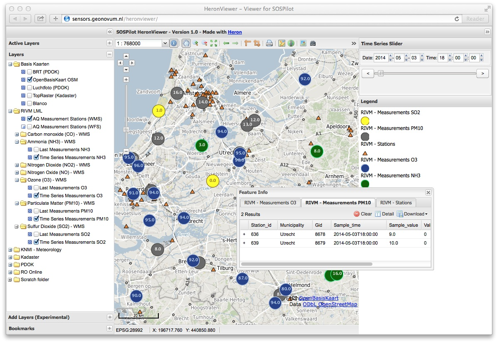
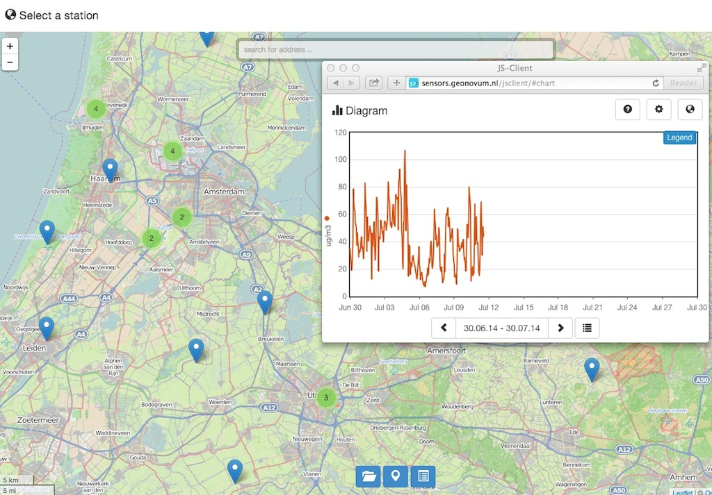
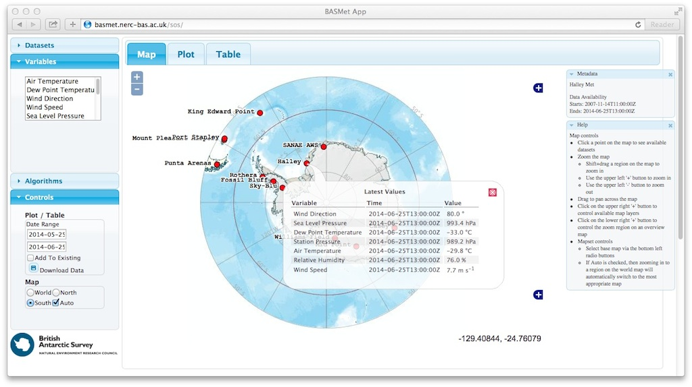
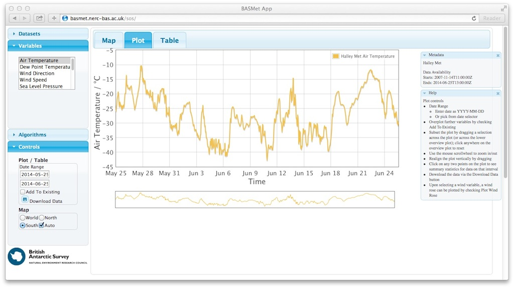
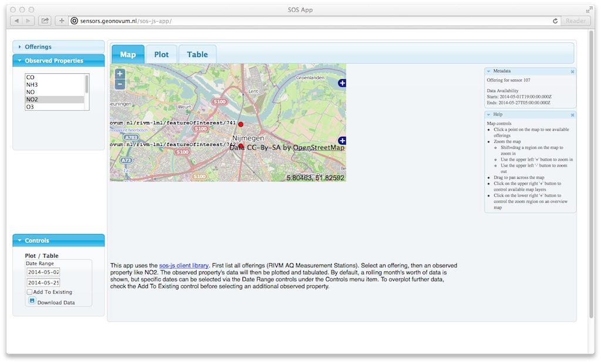
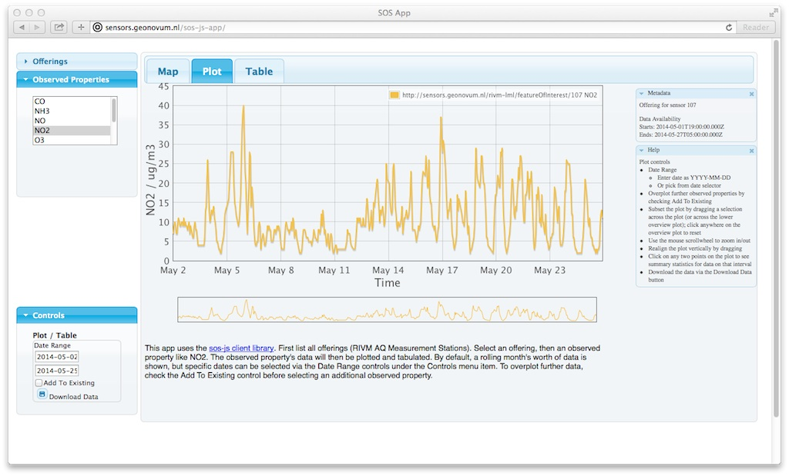
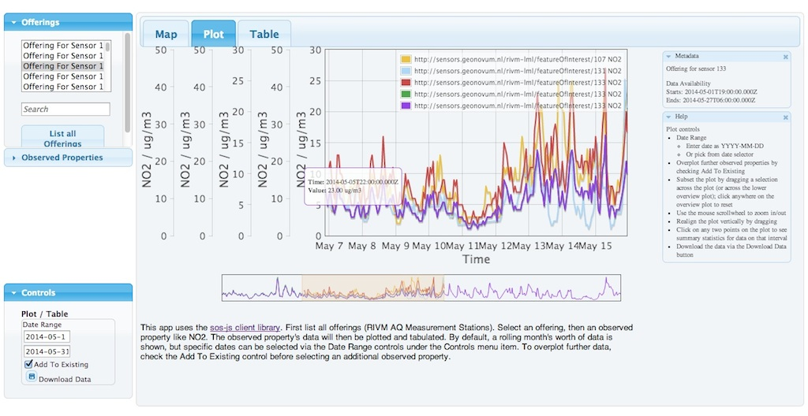

.. _clients:

=======
Clients
=======

This chapter describes how various client applications are realized on top of the
web services In particular:

* WFS and WMS-Time clients
* OWS SOS clients

HeronViewer
===========

Figure 1 depicts a screenshot of the HeronViewer, found at  http://sensors.geonovum.nl/heronviewer .

   *Figure 1 - HeronViewer showing components with time series values*

The HeronViewer is built using the Heron Web Mapping client framework. This is mainly a matter of
providing a configuration of widgets and layer settings.

The main feature of this viewer is that it interacts with the various WMS Layers (see Web Services), using the
OGC standardized WMS Time Dimension, also know as WMS-T.

This viewer uses all standard Heron components, except a for a ``TimeRangePanel``, the slider that
enables the user to go through time. Via WMS-T component measurement values are displayed for that
paricular date and time.

SOS Clients
===========

There are several possible SOS clients.

JS-SensorWeb-Client
-------------------

This client is known as the "pure HTML5 Client". The GitHub is at
https://github.com/52North/js-sensorweb-client
and a nice 52North demo at http://sensorweb.demo.52north.org/jsClient-0.2.0.

This app uses the REST interface of the 52North SOS server, so no extra .war is required.
The REST API is at: http://sensors.geonovum.nl/sos/api/v1/

We install this client as a pure HTML5/JavaScript app (no .war) at:  at URL http://sensors.geonovum.nl/jsclient

Installation from GitHub and local configuration as follows ::

    $ cd /opt/52north/js-sensorweb-client
    $  git clone https://github.com/52North/js-sensorweb-client git
    $ cd git
    # Configure Geonovum/RIVM SOS REST service instances within ./WebContent/js/models/settings.js
      .
      .
    var Settings = {

        // The entries in this list will be removed from the provider list offered to the user
        providerBlackList : [
        {
            serviceID : 'srv_6d9ccea8d609ecb74d4a512922bb7cee', // ircel
            apiUrl : 'http://sensorweb.demo.52north.org/sensorwebclient-webapp-stable/api/v1/'
        },
        {
            serviceID : 'srv_7cabc8c30a85fab035c95882df6db343', // BfG sos
            apiUrl : 'http://sensorweb.demo.52north.org/sensorwebclient-webapp-stable/api/v1/'
        }
        ],

        // A list of timeseries-API urls and an appropriate identifier to create internal timeseries ids
        restApiUrls : {
    //		'http://192.168.1.135:8080/sensorwebclient-webapp/api/v1/' : 'localhost'
    //		'http://localhost:8090/sensorwebclient-webapp-3.3.0-SNAPSHOT/api/v1/' : 'localhost'
    //		'http://sensorweb.demo.52north.org/sensorwebclient-webapp-stable/api/v1/' : '52nSensorweb',
            'http://sosrest.irceline.be/api/v1/' : 'irceline',
                    'http://sensors.geonovum.nl/sos/api/v1/' : 'rivm'
    //		'http://www.fluggs.de/sos2/api/v1/' : 'fluggs'
        },

        // default selected provider
    //	defaultProvider : {
    //		serviceID : 'srv_738111ed219f738cfc85be0c8d87843c',
    //		apiUrl : 'http://sensorweb.demo.52north.org/sensorwebclient-webapp-stable/api/v1/'
    //	},

        defaultProvider : {
            serviceID : 'srv_738111ed219f738cfc85be0c8d87843a',
            apiUrl : 'http://sensors.geonovum.nl/sos/api/v1/'
        },

        // zoom level in the map, used for user location and station position
        zoom : 13,
      .
      .
    # Build with Maven
    $ mvn clean install
    # jsclient is at /opt/52north/js-sensorweb-client/git/target/jsClient-0.2.0
    # deploy in Apache
    $ cp -r target/jsClient-0.2.0 /var/www/sensors.geonovum.nl/site/jsclient

Below is the result.

   *Figure 2 - HTML5 App JSClient at http://sensors.geonovum.nl/jsclient*

SensorWebClient (52N)
---------------------

Homepage: https://wiki.52north.org/bin/view/SensorWeb/SensorWebClient
Installation Guide: https://wiki.52north.org/bin/view/SensorWeb/SensorWebClientInstallationGuide

Install Development line from GitHub ::

    $ cd /opt/52north/sensorwebclient
    $ git clone https://github.com/ridoo/SensorWebClient.git git
    $ cd git
    # Configure SOS instances within ./sensorwebclient-webapp/src/main/webapp/ds/sos-instances.data.xml
    # Copy ${project_root}/sensorwebclient-build-example.properties to ~/sensorwebclient-build-dev.properties
    # Adapt: ~/sensorwebclient-build-dev.properties
    $ cd sensorwebclient-webapp
    $ mvn -e clean install -P env-dev
    # target war: sensorwebclient-webapp/target/sensorwebclient-webapp-3.3.0-SNAPSHOT.war

    # Deploy in Tomcat
    # Als root:
    $ chown tomcat7:tomcat7
         /opt/52north/sensorwebclient/git/sensorwebclient-webapp/target/sensorwebclient-webapp-3.3.0-SNAPSHOT.war
    $ cp /opt/52north/sensorwebclient/git/sensorwebclient-webapp/target/sensorwebclient-webapp-3.3.0-SNAPSHOT.war
        /var/www/sensors.geonovum.nl/webapps/swc.war

The client runs at http://sensors.geonovum.nl:8080/swc but shows no stations for The Netherlands. It does for Belgium.
See also this issue: https://github.com/Geonovum/sospilot/issues/11

SOS-JS Client (52N)
-------------------

This is a "pure" JavaScript client. It builds on OpenLayers and JQuery.

Homepage: https://github.com/52North/sos-js

*SOS.js is a Javascript library to browse, visualise, and access, data from an Open Geospatial Consortium (OGC)*
*Sensor Observation Service (SOS)....This module is built on top of OpenLayers, for low-level SOS request/response handling.*

This client has components for protocol handling (via OpenLayers), maps and visualization
with plotted graphs and tabular data. There are some examples available.

A live application built by the British Antarctic Survey and can be viewed here: http://basmet.nerc-bas.ac.uk/sos. There
is also an advanced viewer: http://add.antarctica.ac.uk/home/add6

   *Figure 3 - app made with SOS-JS by British Antarctic Survey (Map)*

   *Figure 4 - app made with SOS-JS by British Antarctic Survey (Plot)*

We will build a web-app based on the above. This app can be found at: http://sensors.geonovum.nl/sos-js-app
We cannot yet select stations by clcking inthe map, but via the offering list we can
plot a graph for a chemical component for a station during a timeframe.

   *Figure 5 - app made with SOS-JS for SOSPilot (Map)*

   *Figure 6 - app made with SOS-JS for SOSPilot shows NO2 graph for Station Roerdalen,NL00107*

One can also select multiple stations for a pollutant and select date intervals int he time segment.
See Figure 7 below.

   *Figure 7 - app made with SOS-JS for SOSPilot shows NO2 graph for Multiple Stations*

