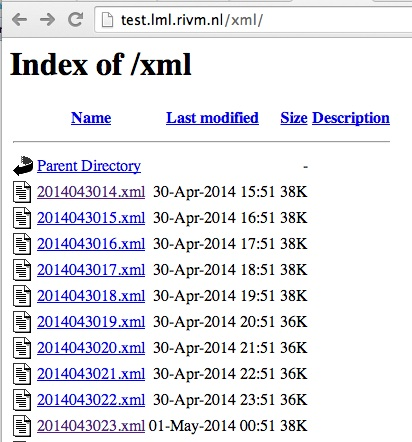
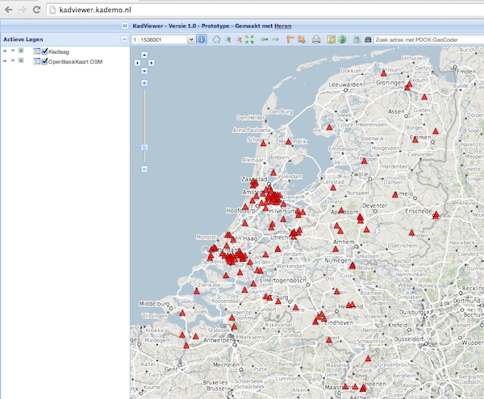
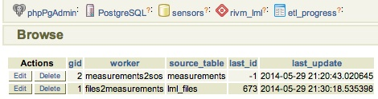
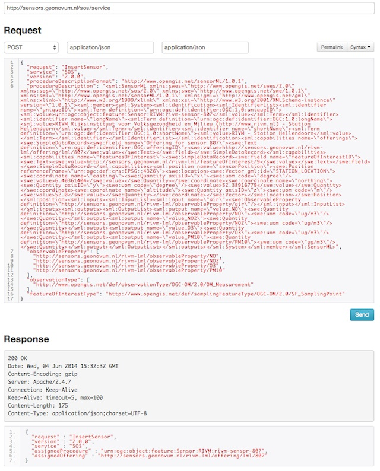
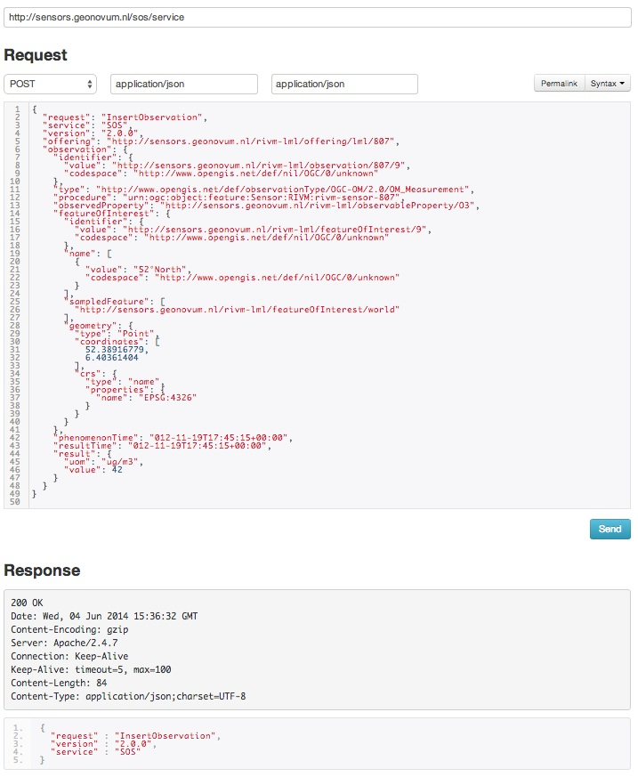
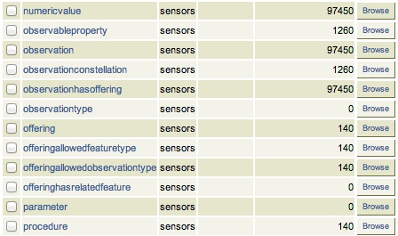

.. _data:

===============
Data Management
===============

This chapter describes all technical aspects related to data within the SOSPilot project. The "data"
as mentioned here is all related to LML RIVM data, i.e. Dutch Air Quality Data.

* obtaining raw source data: measurements, stations etc.
* data transformation (ETL) for various (OWS) services, INSPIRE and E-reporting
* tooling (databases and ETL-tools) for the above

Source code for data management and ETL can be found in GitHub: https://github.com/Geonovum/sospilot/tree/master/src

Architecture
============

Figure 1 sketches the overall SOSPilot architecture with emphasis on the flow of data (arrows).
Circles depict harvesting/ETL processes. Server-instances are in rectangles. Datastores
the "DB"-icons.

.. figure:: _static/sospilot-arch0.jpg
   :align: center

   *Figure 1 - Overall Architecture*

The main challenge/flow of data is from raw XML files with Air Quality data provided by the RIVM LML server.
This server provides a directory of XML files with hourly measurements of the past month.
The big circle "ETL" embeds the data transformation processes and storage that is required to
deliver OGC services for WMS, WFS and SOS.

ETL Design
==========

In this section the ETL is elaborated in more detail as depicted in the figure below.

.. figure:: _static/sospilot-arch1.jpg
   :align: center

   *Figure 2 - Overall Architecture with ETL Steps*

The ETL design comprises three main processing steps and three datastores. The three ETL Steps are:

#. File Harvester: fetch source data from RIVM e.g. from  http://lml.rivm.nl/xml and store locally
#. AQ ETL: transform this local source data to intermediate "Core AQ Data" in PostGIS
#. SOS ETL: transform and publish "Core AQ Data" to the 52N SOS DB via SOS-Transactions (SOS-T)

The detailed dataflow from source to destination is as follows:

#. The File Harvester fetches XML files with AQ/LML measurements from the RIVM server
#. The File Harvester puts these files as XML blobs 1-1 in a Postgres/PostGIS database
#. The AQ ETL process reads these file blobs and transforms these to the Core AQ DB (Raw Measurements)
#. The Core AQ DB contains measurements + stations in regular tables 1-1 with original data, including a Time column
#. The Core AQ DB can be used for OWS (WMS/WFS) services via GeoServer (possibly using VIEW by Measurements/Stations JOIN)
#. The SOS ETL process transforms core AQ data to SOS Observations and publishes Observations using SOS-T InsertObservation
#. These three processes run continuously (via cron)
#. Each process always knows its progress and where it needs to resume, even after it has been stopped (by storing a progress/checkpoint info)

These last two ETL processes manage their ``last sync-time`` using a separate ``progress table`` within the database.
The first (Harvester) only needs to check if a particular XML file (as they have a unique file name) has already been stored.

Advantages of this approach:

* backups of source data possible
* incrementally build up of history past the last month
* in case of (design) errors we can always reset the 'progress timestamp(s)' and restart anew
* simpler ETL scripts than “all-in-one", e.g. from “Core AQ DB” to "52N SOS DB" may even be in plain SQL
* migration with changed in 52N SOS DB schema simpler
* prepared for op IPR/INSPIRE ETL (source is Core OM DB)
* OWS server (WMS/WFS evt WCS) can directly use op Core OM DB (possibly via Measurements/Stations JOIN VIEW evt, see below)

The Open Source ETL tool `Stetl, Streaming ETL <http://www.stetl.org>`_  , is used for most of the transformation steps.
Stetl provides standard modules for building an ETL Chain via a configuration file.
This ETL Chain is a linkage of Input, Filter and Output modules. Each module is a Python class
derived from Stetl base classes. In addition a developer
may add custom modules where standard Stetl modules are not available or to specialize processing aspects.

Stetl has been used sucessfully to publish BAG (Dutch Addresses and Buildings) to INSPIRE Addresses via
XSLT and WFS-T (to the ``deegree WFS server``) but also for transformation of Dutch topography (Top10NL and BGT)
to PostGIS. As Stetl is written in Python it is well-integrated with standard ETL and Geo-tools like GDAl/OGR, XSLT and
PostGIS.

At runtime Stetl (via the ``stetl`` command) basically reads the config file,
creates all modules and links their inputs and outputs. This also makes for an easy programming model
as one only needs to concentrate on a single ETL step.

ETL Step 1. - Harvester
-----------------------

The RIVM data server provides measurements of the past month in a collection
of XML files served by an Apache HTTP server. See figure below.

   *Figure - Apache Server Raw File Listing*

The LML Harvester will continuously read these XML files and store
these in the DB as XML Blobs with their filename in the Postgres
table ``lml_files``.

.. figure:: _static/lml-raw-file-record-xml.jpg
   :align: center

   *Figure - Raw File Record Harvested into DB*

This can be effected by a simple Stetl process activated every 30 mins via the linux
``cron`` service. Stetl has a built-in module for Apache dir listing reading.
Only a derived version needed to be developed in order to track which files have been
read already. This is implemented in the file https://github.com/Geonovum/sospilot/blob/master/src/rivm-lml/apachedirinput.py.

Note: there are two data streams with AQ Data from RIVM: "XML" oriented and "SOS" oriented. We will use the "XML" oriented
as the file format is simpler to process and less redundant with station info. The URL is http://www.lml.rivm.nl/xml.

For completeness, the "SOS" oriented are identical
in measurements, though not rounded, but that should be within error range.

There also seem to be differences, for example "SOS": ::

    <ROW>
        <OPST_OPDR_ORGA_CODE>RIVM</OPST_OPDR_ORGA_CODE>
        <STAT_NUMMER>633</STAT_NUMMER>
        <STAT_NAAM>Zegveld-Oude Meije</STAT_NAAM>
        <MCLA_CODE>regio achtergr</MCLA_CODE>
        <MWAA_WAARDE>-999</MWAA_WAARDE>
        <MWAA_BEGINDATUMTIJD>20140527120000</MWAA_BEGINDATUMTIJD>
        <MWAA_EINDDATUMTIJD>20140527130000</MWAA_EINDDATUMTIJD>
    </ROW>

vs "XML": ::

    <meting>
        <datum>27/05/2014</datum>
        <tijd>13</tijd>
        <station>633</station>
        <component>CO</component>
        <eenheid>ug/m3</eenheid>
        <waarde>223</waarde>
        <gevalideerd>0</gevalideerd>
    </meting>

Gotcha: there is a file called ``actueel.xml`` in the XML stream. This file has to be skipped to avoid double records.

ETL Step 2 - Raw Measurements
-----------------------------

This step produces raw AQ measurements, "AQ ETL" in Figure 2, from raw source (file) data harvested
in the table ``lml_files`` (see Step 1).

Two tables: ``stations`` and ``measurements``. This is a 1:1 transformation from the raw XML.
The ``measurements`` refers to the ``stations`` by a FK ``station_id``. The table ``etl_progress`` is
used to track the last file processed from ``lml_files``.

Stations
~~~~~~~~

Station info is available from Eionet as a CSV file. Coordinates are in EPSG:4258 (also used in INSPIRE).

To create "clean" version of eionet RIVM stations understood by ogr2ogr to read into PostGIS:

* download CSV from http://cdr.eionet.europa.eu/Converters/run_conversion?file=nl/eu/aqd/d/envurreqq/REP_D-NL_RIVM_20131220_D-001.xml&conv=450&source=remote
* this file saves as ``REP_D-NL_RIVM_20131220_D-001.csv``
* copy to stations.csv for cleaning
* stations.csv: remove excess quotes, e.g. """
* stations.csv: replace in CSV header ``Pos`` with ``Lat,Lon``
* stations.csv: replace space between coordinates with comma: e.g ``,51.566389 4.932792,`` becomes ``,51.566389,4.932792,``
* test result stations.csv by uploading in e.g. Geoviewer: http://kadviewer.kademo.nl
* create or update ``stations.vrt`` for OGR mapping
* use stations2postgis.sh to map to PostGIS table
* use stations2gml.sh to map to GML file

See details in GitHub: https://github.com/Geonovum/sospilot/tree/master/data/rivm-lml/stations

Test first by uploading and viewing in a  geoviewer, for example in http://kadviewer.kademo.nl
See result.

   *Figure - RIVM Eionet Stations uploaded/viewed in Heron-based Viewer*

Reading into PostGIS

.. figure:: _static/stations-postgis.jpg
   :align: center

   *Figure - RIVM Eionet Stations Read into Postgres/PostGIS*

Measurements
~~~~~~~~~~~~

Reading raw measurements from the files stored in the ``lml_files`` table is done with a ``Stetl``
process. A specific Stetl Input module was developed to effect reading and parsing the files
and tracking the last id of the file processed.
https://github.com/Geonovum/sospilot/blob/master/src/rivm-lml/lmlfiledbinput.py

The Stetl process is defined in
https://github.com/Geonovum/sospilot/blob/master/src/rivm-lml/files2measurements.cfg

The invokation of that Stetl process is via shell script:
https://github.com/Geonovum/sospilot/blob/master/src/rivm-lml/files2measurements.sh

The data is stored in the ``measurements`` table, as below. ``station_id`` is a foreign key
into the ``stations`` table.

.. figure:: _static/lml-measurements-records.jpg
   :align: center

   *Figure - LML raw measurements stored in Postgres*

Tracking ETL progress for the worker ``files2measurements`` is done in the ``etl_progress`` table.
The ``last_id`` field is the identifier of the last record in the ``lml_files`` table
processed. On each new run the ETL process starts from new records since that last record.

   *Figure - LML ETL Progress Tracked in Postgres*

Some query examples: ::

    -- Laatste 24 uur aan metingen voor station en component
    SELECT  * FROM  rivm_lml.measurements
       WHERE sample_time >  current_timestamp::timestamp without time zone - '1 day'::INTERVAL
          AND component = 'NO' AND station_id = '136' order by sample_time desc;

    -- Laatste meting voor station en component
     SELECT  * FROM  rivm_lml.measurements
       WHERE sample_time >  current_timestamp::timestamp without time zone - '1 day'::INTERVAL
          AND component = 'NO' AND station_id = '136' order by sample_time desc limit 1;

ETL Step 3 - SOS Publication
----------------------------

In this step the Raw Measurements data (see Step 2) is transformed to "SOS Ready Data",
i.e. data that can be handled by the 52North SOS server. Three options:

#. direct transform into the SOS database of the 52N SOS server
#. via "SOS Transactions" i.e. publishing via SOS-protocol (ala WFS-T)
#. via REST

Discussion:

#. Direct publication into the SOS DB (39 tables!) seems to be cumbersome and error prone and not future-proof
#. via "SOS Transactions" (SOS-T) seems a good and standard option
#. Using the REST-API seems the quickest/most efficient way to go, but the status of the REST implementation is unsure.

So from here on publication via SOS-T is further expanded.

SOS Transaction - PoC
~~~~~~~~~~~~~~~~~~~~~

A small Proof-of-Concept using the available requests and sensor ML as example was quite promising.
This also provides an example for the mapping strategy.

We have created JSON ``insert-sensor`` and ``insert-observation`` requests and executed these
in the Admin SOS webclient. Each Sensor denotes a single station with Input just "Air" and one
Output for each chemical Component (here O3, MO, NO2, PM10). These files can serve later as templates
for the ETL via Stetl. The ``insert-sensor`` needs to be done once per Station before invoking any ``InsertObservation``.
The ``insert-observation`` is performed per measurement, though we may consider using an
``insert-result-template`` and then ``insert-result`` or ``SOS-Batch`` operations for efficiency.

See the images below.

   *Figure - Inserting a Station as sensor definition using SOS via 52N SOS Admin webclient*

And the observation insert below.

   *Figure - Inserting a single measured value (O3) as an Observation as using SOS via 52N SOS Admin webclient*

SOS Publication - Stetl Strategy
~~~~~~~~~~~~~~~~~~~~~~~~~~~~~~~~

As Stetl only supports WFS-T, not yet SOS, a SOS Output module ``sosoutput.py`` was developed derived
from the standard ``httpoutput.py`` module. See https://github.com/Geonovum/sospilot/blob/master/src/rivm-lml/sosoutput.py.

Most importantly, the raw RIVM-LML data
from Step 2 needs to be transformed to OWS O&M data. The easiest is to use ``substitutable templates``, like the
Stetl config itself also applies. This means we develop files with SOS Requests in which all variable parts get a
symbolic value like ``{sample_value}``. These templates can be found under
https://github.com/Geonovum/sospilot/tree/master/src/rivm-lml/sostemplates in particular

* https://github.com/Geonovum/sospilot/blob/master/src/rivm-lml/sostemplates/insert-sensor.json InsertSensor
* https://github.com/Geonovum/sospilot/blob/master/src/rivm-lml/sostemplates/procedure-desc.xml Sensor ML
* https://github.com/Geonovum/sospilot/blob/master/src/rivm-lml/sostemplates/insert-observation.json InsertObservation

These templates were derived from the sample SOS requests available in the 52N SOS Admin Client.
Note that we use JSON for the requests, as this is simpler than XML. The Sensor ML is embedded in the
insert-sensor JSON request.

SOS Publication - Sensors
~~~~~~~~~~~~~~~~~~~~~~~~~

This step needs to be performed only once, or when any of the original Station data (CSV) changes.

The Stetl config https://github.com/Geonovum/sospilot/blob/master/src/rivm-lml/stations2sensors.cfg
uses a Standard Stetl module, ``inputs.dbinput.PostgresDbInput`` for obtaining Record data from a Postgres database. ::

    {{
      "request": "InsertSensor",
      "service": "SOS",
      "version": "2.0.0",
      "procedureDescriptionFormat": "http://www.opengis.net/sensorML/1.0.1",
      "procedureDescription": "{procedure-desc.xml}",
       "observableProperty": [
        "http://sensors.geonovum.nl/rivm-lml/observableProperty/benzeen",
        "http://sensors.geonovum.nl/rivm-lml/observableProperty/CO",
        "http://sensors.geonovum.nl/rivm-lml/observableProperty/NH3",
        "http://sensors.geonovum.nl/rivm-lml/observableProperty/NO",
        "http://sensors.geonovum.nl/rivm-lml/observableProperty/NO2",
        "http://sensors.geonovum.nl/rivm-lml/observableProperty/O3",
        "http://sensors.geonovum.nl/rivm-lml/observableProperty/PM10",
        "http://sensors.geonovum.nl/rivm-lml/observableProperty/PM25",
        "http://sensors.geonovum.nl/rivm-lml/observableProperty/SO2"
      ],
      "observationType": [
        "http://www.opengis.net/def/observationType/OGC-OM/2.0/OM_Measurement"
      ],
      "featureOfInterestType": "http://www.opengis.net/def/samplingFeatureType/OGC-OM/2.0/SF_SamplingPoint"
    }}

The SOSTOutput module will expand ``{procedure-desc.xml}`` with the Sensor ML template.

SOS Publication - Observations
~~~~~~~~~~~~~~~~~~~~~~~~~~~~~~

The Stetl config https://github.com/Geonovum/sospilot/blob/master/src/rivm-lml/measurements2sos.cfg
uses an extended Stetl module (``inputs.dbinput.PostgresDbInput``) for obtaining Record data from a Postgres database:
https://github.com/Geonovum/sospilot/blob/master/src/rivm-lml/measurementsdbinput.py.
This is required to track progress in the ``etl_progress`` table similar as in Step 2.
The ``last_id`` is remembered.

The Observation template looks as follows. ::

   {{
      "request": "InsertObservation",
      "service": "SOS",
      "version": "2.0.0",
      "offering": "http://sensors.geonovum.nl/rivm-lml/offering/{station_id}",
      "observation": {{
        "identifier": {{
          "value": "{unique_id}",
          "codespace": "http://www.opengis.net/def/nil/OGC/0/unknown"
        }},
        "type": "http://www.opengis.net/def/observationType/OGC-OM/2.0/OM_Measurement",
        "procedure": "http://sensors.geonovum.nl/rivm-lml/procedure/{station_id}",
        "observedProperty": "http://sensors.geonovum.nl/rivm-lml/observableProperty/{component}",
        "featureOfInterest": {{
          "identifier": {{
            "value": "http://sensors.geonovum.nl/rivm-lml/featureOfInterest/{station_id}",
            "codespace": "http://www.opengis.net/def/nil/OGC/0/unknown"
          }},
          "name": [
            {{
              "value": "{municipality}",
              "codespace": "http://www.opengis.net/def/nil/OGC/0/unknown"
            }}
          ],
          "geometry": {{
            "type": "Point",
            "coordinates": [
              {station_lat},
              {station_lon}
            ],
            "crs": {{
              "type": "name",
              "properties": {{
                "name": "EPSG:4326"
              }}
            }}
          }}
        }},
        "phenomenonTime": "{sample_time}",
        "resultTime": "{sample_time}",
        "result": {{
          "uom": "ug/m3",
          "value": {sample_value}
        }}
      }}
   }}

It is quite trivial in ``sosoutput.py`` to substitute these values from the ``measurements``-table records.

Like in ETL Step 2 the progress is remembered in the table ``rivm_lml.etl_progress`` by updating the ``last_id`` field
after publication, where that value represents the ``gid`` value of ``rivm_lml.measurements``.

SOS Publication - Results
~~~~~~~~~~~~~~~~~~~~~~~~~

We can observe the database being filled:

   *Figure - SOS server database being filled: 140 Sensors (Stations) about 100000 Observations inserted*

Via the standard SOS protocol the results can be tested:

* GetCapabilities: http://sensors.geonovum.nl/sos/service?service=SOS&request=GetCapabilities
* DescribeSensor (station 807, Hellendoorn): http://tinyurl.com/mmsr9hl  (URL shortened)
* GetObservation: http://tinyurl.com/ol82sxv (URL shortened)

REST API
~~~~~~~~

For now the REST API will **not** be used since SOS-T is used (see above).
Below is for possible future reference.

Documentation REST API: http://52north.org/files/sensorweb/docs/sos/restful/restful_sos_documentation.pdf

REST root URL: http://sensors.geonovum.nl/sos/service/rest

From the documentation the mapping seems to make sense as follows:

* ``sensor-create``  - to create new sensor resources --> map from ``stations`` table
* ``observation-create``  - to create observation resources --> map from ``measurements`` table

Design:

* use Stetl: input Postgres Query, output SOS-REST module
* similar to ETL step 2
* track progress in ``etl_progress`` table
* new Stetl output, similar to WFS-T and deegree-publisher
* use Python XML templates for the requests
* problem: make SML, Sensor per Station, or Sensor per Station-Component ?

