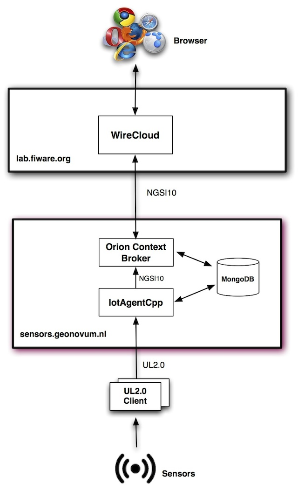
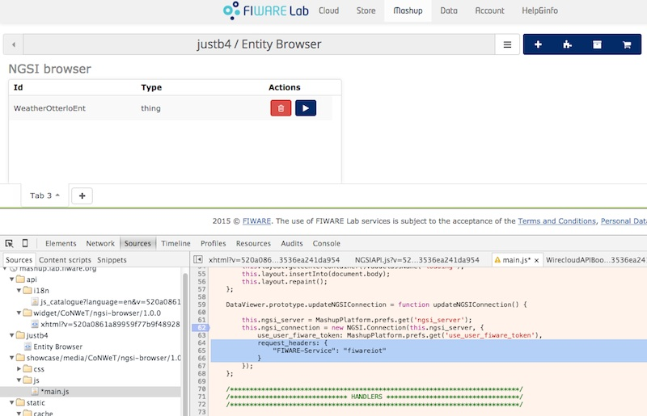
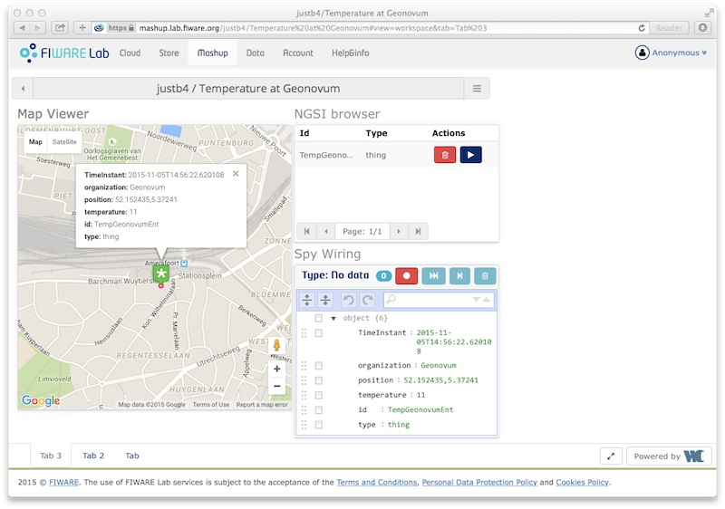
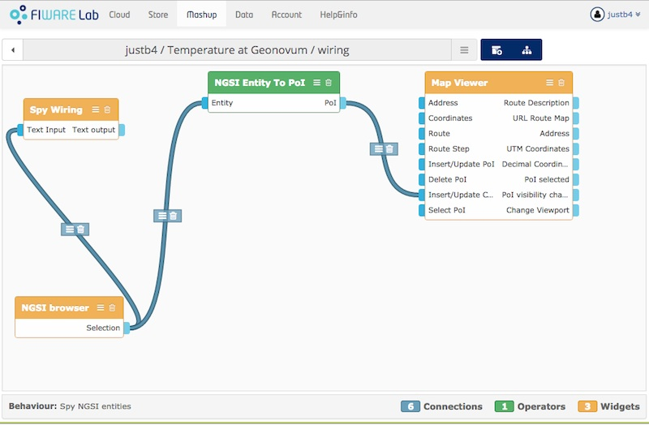

.. _fiwareeval:

===================
FIWARE - Evaluation
===================

Starting in october 2015 the SOSPilot platform was extended to use and deploy FIWARE.

The Plan
========

1. register at lab.fiware.org (justb4)
2. get connected to public services in Lab
3. basic Context Broker (Orion) interaction
4. publish temperatures to IDAS using UltraLight protocol
5. get temperatures from Orion CB
6. show in Wirecloud Mashup

The architecture used for this setup is depicted below. This
architecture emerged dynamically as described below.

This setup is similar
as in this `FIWARE presentation <http://www.slideshare.net/FI-WARE/fiware-iotidasintroul20v2>`_.

   *Architecture for FIWARE within SOSPilot platform*

From bottom to top the setup is as follows:

* Sensors or manual input use the UltraLight 2.0 (UL2.0) protocol for managing services and devices and sending observations
* A client library is used to facilitate using the UL2.0 protocol
* The client may reside anywhere on the Internet
* the server ``sensors.geonovum.nl`` hosts the FIWARE components ``Orion Context Broker`` and the ``IoTAgentCpp``
* all persistence for these components is done in ``MongoDB``
* the ``IoTAgentCpp`` translates requests from the UL2.0 clients to Orion CB NGSI requests
* ``WireCloud`` (WC), the Mashup environment runs in the FIWARE Lab server at lab.fiware.org
* WC communicates to (any) OCB using the NGSI10 protocol
* within WC mashups are produced in order to view and interact with the sensor data

NGSI10 is a specification from the Open Mobile Alliance (OMA).
The FI-WARE version of the OMA NGSI 10 interface is a
`RESTful API via HTTP <https://forge.fiware.org/plugins/mediawiki/wiki/fiware/index.php/FI-WARE_NGSI-10_Open_RESTful_API_Specification>`.

FIWARE Docs
===========

http://fiware-iot-stack.readthedocs.org/en/latest/index.html

Via lab.fiware.org
==================

Registering at the international FIWARE Lab worked ok, but could not get
the Orion CB with the IDAS IoTAgent working. The interaction between the two
seemed to be broken. This was reported, see specifics here:
http://stackoverflow.com/questions/32933813/fiware-no-observation-attributes-in-orion-cb-when-registered-sent-via-idas-ultr

And appearantly by others as well.

http://stackoverflow.com/questions/31051501/missing-attributes-on-orion-cb-entity-when-registering-device-through-idas

After an unsuccessful attempt to compile and run the OCB and IoT Agent on Ubuntu 14.04-3
it was decided to use Docker. This seems the best/recommended option anyway as CentOS is the primary
target platform for FIWARE. See next section.

Installing FIWARE - with Docker
===============================

See http://www.slideshare.net/dmoranj/iot-agents-introduction

Install Docker
--------------

See https://docs.docker.com/installation/ubuntulinux. Install via Docker APT repo.

Steps. ::

	# Kernel version OK for Docker
	$ uname -r
	3.13.0-66-generic

	# Add key
	apt-key adv --keyserver hkp://pgp.mit.edu:80 --recv-keys 58118E89F3A912897C070ADBF76221572C52609D

	# Add to repo by putting this line in /etc/apt/sources.list.d/docker.list
	add deb https://apt.dockerproject.org/repo ubuntu-trusty main to

	$ apt-get update
	$ apt-cache policy docker-engine

	# install docker engine
	apt-get update
	apt-get install docker-engine

	# test
	docker run hello-world
	docker run -it ubuntu bash

	# cleanup non-running images
	docker rm -v $(docker ps -a -q -f status=exited)
	docker rmi $(docker images -f "dangling=true" -q)

Docker-compose. https://docs.docker.com/compose/install. Easiest via ``pip``. ::

	$ pip install docker-compose

See also CLI utils for ``docker-compose``: https://docs.docker.com/v1.5/compose/cli/

Docker utils.  ::

	docker ps -a

	# go into docker image named docker_iotacpp_1 to bash prompt
	docker exec -it docker_iotacpp_1 bash

Install FIWARE for IoT
----------------------

Installing FIWARE components to realize IoT setup: IoT Agent, Orion CB with MongoDB persistence.
Intro: http://www.slideshare.net/dmoranj/iot-agents-introduction

Docker compose for fiware-IoTAgent-Cplusplus: https://github.com/telefonicaid/fiware-IoTAgent-Cplusplus/tree/develop/docker

Steps. Follow: https://github.com/telefonicaid/fiware-IoTAgent-Cplusplus/blob/develop/docker/readme.md ::

	mkdir -p /opt/fiware/iotagent
	cd /opt/fiware/iotagent
	git clone https://github.com/telefonicaid/fiware-IoTAgent-Cplusplus iotacpp

	#
	cd /opt/fiware/iotagent/iotacpp/docker

	# Private docker config ?? (Gave problems)
	cp -r iotacpp/docker .

Networking from outside to docker containers. See http://blog.oddbit.com/2014/08/11/four-ways-to-connect-a-docker.
Make two utilities, ``docker-pid`` and ``docker-ip`` in ``/opt/bin``.  ::

	#!/bin/sh

	exec docker inspect --format '{{ .State.Pid }}' "$@"

	#!/bin/sh

	exec docker inspect --format '{{ .NetworkSettings.IPAddress }}' "$@"

But simpler is to follow: https://docs.docker.com/userguide/dockerlinks/ and even easier via ``docker-compose`` ``iota.yaml``:
https://docs.docker.com/compose/yml. Use the ``ports`` property:
"Expose ports. Either specify both ports (HOST:CONTAINER), or just the container port (a random host port will be chosen)."
So our iota.yml becomes:

.. literalinclude:: ../src/fiware/docker/iota.yaml
    :language: yaml

Now start. ::

	# Start containers (-d iotacpp option not required?)
	$ docker-compose -f iota.yaml up

	# Stopping
	$ docker-compose -f iota.yaml stop

	# check
	$ docker images
	REPOSITORY              TAG                 IMAGE ID            CREATED             VIRTUAL SIZE
	fiware/orion            latest              a5f228ae72c3        19 hours ago        277.1 MB
	telefonicaiot/iotacpp   latest              583fbe68b08e        28 hours ago        2.092 GB
	mongo                   2.6                 dd4b3c1d1e51        5 days ago          392.8 MB
	ubuntu                  latest              1d073211c498        6 days ago          187.9 MB
	hello-world             latest              0a6ba66e537a        2 weeks ago         960 B

	$ docker ps
	CONTAINER ID        IMAGE                   COMMAND                  CREATED              STATUS              PORTS                                                                      NAMES
	1c9dceec8ec8        telefonicaiot/iotacpp   "/docker-entrypoint.s"   6 seconds ago        Up 5 seconds        0.0.0.0:32772->1883/tcp, 0.0.0.0:8000->8080/tcp, 0.0.0.0:32771->8081/tcp   docker_iotacpp_1
	7f463ea679b6        fiware/orion            "/usr/bin/contextBrok"   About a minute ago   Up 5 seconds        0.0.0.0:32770->1026/tcp                                                    docker_orion_1
	41028cff906b        mongo:2.6               "/entrypoint.sh --sma"   29 hours ago         Up 6 seconds        27017/tcp                                                                  docker_mongodb_1

	# get into a container with bash
	docker exec -it docker_orion_1 bash
	[root@1c9dceec8ec8 /]# ps -elf
	F S UID        PID  PPID  C PRI  NI ADDR SZ WCHAN  STIME TTY          TIME CMD
	4 S root         1     0  0  80   0 - 50812 hrtime 15:19 ?        00:00:00 /usr/bin/contextBroker -fg -multiservice
	4 S root       976     0  0  80   0 -  3374 wait   15:35 ?        00:00:00 bash
	0 R root      1021   976  0  80   0 -  3846 -      15:36 ?        00:00:00 ps -elf

	[root@1c9dceec8ec8 /]# cat /etc/hosts
	172.17.0.41	1c9dceec8ec8
	127.0.0.1	localhost
	::1	localhost ip6-localhost ip6-loopback
	fe00::0	ip6-localnet
	ff00::0	ip6-mcastprefix
	ff02::1	ip6-allnodes
	ff02::2	ip6-allrouters
	172.17.0.40	mongodb 41028cff906b docker_mongodb_1
	172.17.0.40	mongodb_1 41028cff906b docker_mongodb_1
	172.17.0.40	docker_mongodb_1 41028cff906b
	172.17.0.40	docker_mongodb_1.bridge
	172.17.0.41	docker_orion_1.bridge
	172.17.0.41	docker_orion_1
	172.17.0.40	docker_mongodb_1
	172.17.0.42	docker_iotacpp_1
	172.17.0.42	docker_iotacpp_1.bridge

	# Check Orion
	$ curl 172.17.0.41:1026/statistics
	<orion>
		<versionRequests>0</versionRequests>
		<statisticsRequests>1</statisticsRequests>
		<uptime_in_secs>1472</uptime_in_secs>
		<measuring_interval_in_secs>1472</measuring_interval_in_secs>
		<subCacheRefreshs>3</subCacheRefreshs>
		<subCacheInserts>0</subCacheInserts>
		<subCacheRemoves>0</subCacheRemoves>
		<subCacheUpdates>0</subCacheUpdates>
		<subCacheItems>0</subCacheItems>
	</orion>

	# Check iot agent iotacpp
	$ docker exec -it docker_iotacpp_1 bash
	[root@8e317c6b9405 /]# ps -elf
	F S UID        PID  PPID  C PRI  NI ADDR SZ WCHAN  STIME TTY          TIME CMD
	4 S root         1     0  0  80   0 -  4821 poll_s 15:49 ?        00:00:00 /sbin/init
	1 S root        74     1  0  80   0 -  2673 poll_s 15:49 ?        00:00:00 /sbin/udevd -d
	5 S iotagent   292     1  0  80   0 - 12087 poll_s 15:49 ?        00:00:00 /usr/sbin/mosquitto -d -c /etc/iot/mosquitto.conf
	0 S iotagent   312     1  0  80   0 - 186499 futex_ 15:49 ?       00:00:00 /usr/local/iot/bin/iotagent -n IoTPlatform -v ERROR -i 0.0.0.0 -p 8080 -d /usr/local/iot/lib -c /etc/iot/config.json
	0 S root       365     1  0  80   0 -  1028 hrtime 15:50 ?        00:00:00 /sbin/mingetty /dev/tty[1-6]
	4 S root       366     0  1  80   0 - 27087 wait   15:50 ?        00:00:00 bash
	0 R root       378   366  0  80   0 - 27557 -      15:50 ?        00:00:00 ps -elf
	[root@8e317c6b9405 /]# curl -g -X GET http://127.0.0.1:8080/iot/about
	Welcome to IoTAgents  identifier:IoTPlatform:8080  1.3.0 commit 128.g14ee433 in Oct 28 2015
	[root@8e317c6b9405 /]#

	# and from outside
	curl -g -X GET http://sensors.geonovum.nl:8000/iot/about
	Welcome to IoTAgents  identifier:IoTPlatform:8080  1.3.0 commit 128.g14ee433 in Oct 28 2015

	# Get log output
	# See https://docs.docker.com/v1.5/compose/cli
	$ docker-compose -f iota.yaml logs

Testing IoTAgent-Orion
----------------------

Simple scenario, using the UltraLight (UL2.0) IoT protocol.:

1. create IoT service via IoTAgent (IDAS)
2. create IoT device via IoTAgent (IDAS)
3. observe new Entity in Orion
4. send temperature via IDAS
5. observe changed Entity via Orion

See tutorial at: http://www.slideshare.net/FI-WARE/fiware-iotidasintroul20v2. Documentation
https://fiware-orion.readthedocs.org/en/develop (OCB).

Sending commands from local system using FIWARE FIGWAY (python-IDAS4): https://github.com/telefonicaid/fiware-figway/tree/master/python-IDAS4.
These are a set of Python commands for most common REST services for both the OCB and IoTAgent/Manager.

Prepare the right ``config.ini`` used by all Python commands ::

	[user]
	# Please, configure here your username at FIWARE Cloud and a valid Oauth2.0 TOKEN for your user
	# (you can use get_token.py to obtain a valid TOKEN).
	username=(not required)
	token=(not required here)

	[contextbroker]
	# host=130.206.80.40
	host=sensors.geonovum.nl
	port=1026
	OAuth=no
	# Here you need to specify the ContextBroker database you are querying.
	# Leave it blank if you want the general database or the IDAS service if you are
	# looking for IoT devices connected by you.
	fiware_service=fiwareiot
	# fiware_service=bus_auto
	fiware-service-path=/

	[idas]
	host=sensors.geonovum.nl
	# host=130.206.80.40
	#adminport=5371
	#ul20port=5371
	adminport=8081
	ul20port=8000
	OAuth=no
	# Here you need to configure the IDAS service your devices will be sending data to.
	# By default the OpenIoT service is provided.
	#
	#fiware-service=fiwareiot
	fiware-service=fiwareiot
	# fiware-service=bus_auto
	fiware-service-path=/
	apikey=4jggokgpepnvsb2uv4s40d59ov

	[local]
	#Choose here your System type. Examples: RaspberryPI, MACOSX, Linux, ...
	host_type=MACOSX
	# Here please add a unique identifier for you. Suggestion: the 3 lower hexa bytes of your Ethernet MAC. E.g. 79:ed:af
	# Also you may use your e-mail address.
	host_id=a0:11:00

Create device template (called ``OTTERLO_TEMP``) under
https://github.com/telefonicaid/fiware-figway/tree/master/python-IDAS4/Sensors_UL20/devices ::

	{
	 "devices": [
	    { "device_id": "DEV_ID",
	      "entity_name": "ENTITY_ID",
	      "entity_type": "thing",
	      "protocol": "PDI-IoTA-UltraLight",
	      "timezone": "Europe/Amsterdam",
	"attributes": [
	        { "object_id": "ot",
	          "name": "temperature",
	          "type": "int"
	        } ],
	 "static_attributes": [
	        { "name": "location",
	          "type": "string",
	          "value": "BosHut"
	        }
	       ]
	      }
	     ]
	    }

Create service, then a device and send an observation using Python code under
https://github.com/telefonicaid/fiware-figway/tree/master/python-IDAS4/Sensors_UL20 (IoTAgent with UL protocol) and
https://github.com/telefonicaid/fiware-figway/tree/master/python-IDAS4/ContextBroker (OCB).
Watch that the related Entity is created in the OCB and that it gets an attribute value when sending
an Observation to the IoTAgent. ::

	# IoTAgent: List devices (none present)
	python ListDevices.py
	* Asking to http://sensors.geonovum.nl:8000/iot/devices
	* Headers: {'Fiware-Service': 'fiwareiot', 'content-type': 'application/json', 'Fiware-ServicePath': '/', 'X-Auth-Token': 'NULL'}
	...

	* Status Code: 200
	* Response:
	{ "count": 0,"devices": []}

	# OCB: Show Entities ot OCB (none present)
	$ python GetEntities.py ALL
	* Asking to http://sensors.geonovum.nl:1026/ngsi10/queryContext
	* Headers: {'Fiware-Service': 'fiwareiot', 'content-type': 'application/json', 'accept': 'application/json', 'X-Auth-Token': 'NULL'}
	* Sending PAYLOAD:
	{
	    "entities": [
	        {
	            "type": "",
	            "id": ".*",
	            "isPattern": "true"
	        }
	    ],
	    "attributes": []
	}

	# IoTAgent: Create an IoT service
	$ python CreateService.py fiwareiot 4jggokgpepnvsb2uv4s40d59ov 185.21.189.59 1026
	* Asking to http://sensors.geonovum.nl:8000/iot/services
	* Headers: {'Fiware-Service': 'fiwareiot', 'content-type': 'application/json', 'Fiware-ServicePath': '/', 'X-Auth-Token': 'NULL'}
	* Sending PAYLOAD:
	{
	    "services": [
	        {
	            "token": "token2",
	            "apikey": "4jggokgpepnvsb2uv4s40d59ov",
	            "resource": "/iot/d",
	            "entity_type": "thing",
	            "cbroker": "http://185.21.189.59:1026"
	        }
	    ]
	}

	# IoTAgent: Register a Device passing related Entity name
	$ python RegisterDevice.py OTTERLO_TEMP NexusProDev WeatherOtterloEnt
	* opening: ./devices/OTTERLO_TEMP
	* Asking to http://sensors.geonovum.nl:8000/iot/devices
	* Headers: {'Fiware-Service': 'fiwareiot', 'content-type': 'application/json', 'Fiware-ServicePath': '/', 'X-Auth-Token': 'NULL'}
	* Sending PAYLOAD:
	{
	    "devices": [
	        {
	            "protocol": "PDI-IoTA-UltraLight",
	            "entity_name": "WeatherOtterloEnt",
	            "entity_type": "thing",
	            "static_attributes": [
	                {
	                    "type": "string",
	                    "name": "location",
	                    "value": "BosHut"
	                }
	            ],
	            "timezone": "Europe/Amsterdam",
	            "attributes": [
	                {
	                    "type": "int",
	                    "name": "temperature",
	                    "object_id": "ot"
	                }
	            ],
	            "device_id": "NexusProDev"
	        }
	    ]
	}

	...

	* Status Code: 201

    # IoTAgent: List the newly added device
	$ python ListDevices.py
	* Asking to http://sensors.geonovum.nl:8000/iot/devices
	* Headers: {'Fiware-Service': 'fiwareiot', 'content-type': 'application/json', 'Fiware-ServicePath': '/', 'X-Auth-Token': 'NULL'}
	...

	* Status Code: 200
	* Response:
	{ "count": 1,"devices": [{ "device_id" : "NexusProDev" }]}

	# OCB: Show related Entity in OCB
	$ python GetEntities.py ALL
	* Asking to http://sensors.geonovum.nl:1026/ngsi10/queryContext
	* Headers: {'Fiware-Service': 'fiwareiot', 'content-type': 'application/json', 'accept': 'application/json', 'X-Auth-Token': 'NULL'}
	* Sending PAYLOAD:
	{
	    "entities": [
	        {
	            "type": "",
	            "id": ".*",
	            "isPattern": "true"
	        }
	    ],
	    "attributes": []
	}

	...

	* Status Code: 200
	***** Number of Entity Types: 1

	***** List of Entity Types
	<entityId type="thing" isPattern="false"> : 1

	**** Number of Entity IDs: 1

	**** List of Entity IDs
	<id>WeatherOtterloEnt< : 1

	Do you want me to print all Entities? (yes/no)yes
	<queryContextResponse>
	  <contextResponseList>
	    <contextElementResponse>
	      <contextElement>
	        <entityId type="thing" isPattern="false">
	          <id>WeatherOtterloEnt</id>
	        </entityId>
	        <contextAttributeList>
	          <contextAttribute>
	            <name>TimeInstant</name>
	            <type>ISO8601</type>
	            <contextValue>2015-10-30T20:21:17.557970</contextValue>
	          </contextAttribute>
	          <contextAttribute>
	            <name>location</name>
	            <type>string</type>
	            <contextValue>BosHut</contextValue>
	            <metadata>
	              <contextMetadata>
	                <name>TimeInstant</name>
	                <type>ISO8601</type>
	                <value>2015-10-30T20:21:17.558093</value>
	              </contextMetadata>
	            </metadata>
	          </contextAttribute>
	        </contextAttributeList>
	      </contextElement>
	      <statusCode>
	        <code>200</code>
	        <reasonPhrase>OK</reasonPhrase>
	      </statusCode>
	    </contextElementResponse>
	  </contextResponseList>
	</queryContextResponse>

	# IoTAgent: Send an Observation to device
	$ python SendObservation.py NexusProDev 'ot|16'
	* Asking to http://sensors.geonovum.nl:8000/iot/d?k=4jggokgpepnvsb2uv4s40d59ov&i=NexusProDev
	* Headers: {'Fiware-Service': 'fiwareiot', 'content-type': 'application/json', 'Fiware-ServicePath': '/', 'X-Auth-Token': 'NULL'}
	* Sending PAYLOAD:
	ot|16

	...

	* Status Code: 200
	* Response:

	# OCB: See value in Entity
    python GetEntities.py ALL
    * Asking to http://sensors.geonovum.nl:1026/ngsi10/queryContext
    * Headers: {'Fiware-Service': 'fiwareiot', 'content-type': 'application/json', 'accept': 'application/json', 'X-Auth-Token': 'NULL'}
    * Sending PAYLOAD:
    {
        "entities": [
            {
                "type": "",
                "id": ".*",
                "isPattern": "true"
            }
        ],
        "attributes": []
    }

    ...

    * Status Code: 200
    ***** Number of Entity Types: 1

    ***** List of Entity Types
    <entityId type="thing" isPattern="false"> : 1

    **** Number of Entity IDs: 1

    **** List of Entity IDs
    <id>WeatherOtterloEnt< : 1

    Do you want me to print all Entities? (yes/no)yes
    <queryContextResponse>
      <contextResponseList>
        <contextElementResponse>
          <contextElement>
            <entityId type="thing" isPattern="false">
              <id>WeatherOtterloEnt</id>
            </entityId>
            <contextAttributeList>
              <contextAttribute>
                <name>TimeInstant</name>
                <type>ISO8601</type>
                <contextValue>2015-10-30T21:04:13.770532</contextValue>
              </contextAttribute>
              <contextAttribute>
                <name>location</name>
                <type>string</type>
                <contextValue>BosHut</contextValue>
                <metadata>
                  <contextMetadata>
                    <name>TimeInstant</name>
                    <type>ISO8601</type>
                    <value>2015-10-30T21:04:13.770563</value>
                  </contextMetadata>
                </metadata>
              </contextAttribute>
              <contextAttribute>
                <name>temperature</name>
                <type>int</type>
                <contextValue>16</contextValue>
                <metadata>
                  <contextMetadata>
                    <name>TimeInstant</name>
                    <type>ISO8601</type>
                    <value>2015-10-30T21:04:13.770532</value>
                  </contextMetadata>
                </metadata>
              </contextAttribute>
            </contextAttributeList>
          </contextElement>
          <statusCode>
            <code>200</code>
            <reasonPhrase>OK</reasonPhrase>
          </statusCode>
        </contextElementResponse>
      </contextResponseList>
    </queryContextResponse>

    # Get Context Types, note: --header 'Fiware-Service: fiwareiot' needs to be present!!
	$ curl sensors.geonovum.nl:1026/v1/contextTypes -S --header 'Accept: application/json' --header 'Fiware-Service: fiwareiot'
	{
	  "types" : [
	    {
	      "name" : "thing",
	      "attributes" : [
	        "temperature",
	        "location",
	        "TimeInstant"
	      ]
	    }
	  ],
	  "statusCode" : {
	    "code" : "200",
	    "reasonPhrase" : "OK"
	  }
	}

	# Get Context Entities, note: --header 'Fiware-Service: fiwareiot' needs to be present!!
	$ curl sensors.geonovum.nl:1026/v1/contextEntities -S --header 'Accept: application/json' --header 'Fiware-Service: fiwareiot'
	{
	  "contextResponses" : [
	    {
	      "contextElement" : {
	        "type" : "thing",
	        "isPattern" : "false",
	        "id" : "WeatherOtterloEnt",
	        "attributes" : [
	          {
	            "name" : "TimeInstant",
	            "type" : "ISO8601",
	            "value" : "2015-10-31T12:55:28.157330"
	          },
	          {
	            "name" : "location",
	            "type" : "string",
	            "value" : "BosHut",
	            "metadatas" : [
	              {
	                "name" : "TimeInstant",
	                "type" : "ISO8601",
	                "value" : "2015-10-31T12:55:28.157371"
	              }
	            ]
	          },
	          {
	            "name" : "temperature",
	            "type" : "int",
	            "value" : "11",
	            "metadatas" : [
	              {
	                "name" : "TimeInstant",
	                "type" : "ISO8601",
	                "value" : "2015-10-31T12:55:28.157330"
	              }
	            ]
	          }
	        ]
	      },
	      "statusCode" : {
	        "code" : "200",
	        "reasonPhrase" : "OK"
	      }
	    }
	  ]
	}

Testing with MQTT Client
------------------------

The IoTAgent also supports the MQTT protocol: http://mqtt.org

*MQTT is a machine-to-machine (M2M)/"Internet of Things" connectivity protocol. It was designed as an extremely lightweight publish/subscribe messaging transport.*

We will use Mosquitto as MQTT-client first:

*Mosquitto is an open source (BSD licensed) message broker that implements the MQ Telemetry Transport protocol*
*versions 3.1 and 3.1.1. MQTT provides a lightweight method of carrying out messaging using a publish/subscribe model.*

On Mac OSX install Mosquitto via HomeBrew: ::

	$ brew install mosquitto
	==> Installing dependencies for mosquitto: c-ares, libwebsockets
	==> Installing mosquitto dependency: c-ares
	==> Downloading https://homebrew.bintray.com/bottles/c-ares-1.10.0.mavericks.bottle.tar.gz
	######################################################################## 100,0%
	==> Pouring c-ares-1.10.0.mavericks.bottle.tar.gz
	🍺  /usr/local/Cellar/c-ares/1.10.0: 57 files, 540K
	==> Installing mosquitto dependency: libwebsockets
	==> Downloading https://homebrew.bintray.com/bottles/libwebsockets-1.4.mavericks.bottle.tar.gz
	######################################################################## 100,0%
	==> Pouring libwebsockets-1.4.mavericks.bottle.tar.gz
	🍺  /usr/local/Cellar/libwebsockets/1.4: 23 files, 3,3M
	==> Installing mosquitto
	==> Downloading https://homebrew.bintray.com/bottles/mosquitto-1.4.2.mavericks.bottle.tar.gz
	######################################################################## 100,0%
	==> Pouring mosquitto-1.4.2.mavericks.bottle.tar.gz
	==> Caveats
	mosquitto has been installed with a default configuration file.
	You can make changes to the configuration by editing:
	/usr/local/etc/mosquitto/mosquitto.conf

	To have launchd start mosquitto at login:
	ln -sfv /usr/local/opt/mosquitto/*.plist ~/Library/LaunchAgents
	Then to load mosquitto now:
	launchctl load ~/Library/LaunchAgents/homebrew.mxcl.mosquitto.plist
	Or, if you don't want/need launchctl, you can just run:
	mosquitto -c /usr/local/etc/mosquitto/mosquitto.conf
	==> Summary
	🍺  /usr/local/Cellar/mosquitto/1.4.2: 28 files, 700K

Use ``mosquitto_pub`` as a commandline client http://mosquitto.org/man/mosquitto_pub-1.html for initial tests.  ::

	$ mosquitto_pub -d -h sensors.geonovum.nl -p 1883 -t sensors/temperature -m "1266193804 32"
	Client mosqpub/18773-sunda sending CONNECT
	Client mosqpub/18773-sunda received CONNACK
	Client mosqpub/18773-sunda sending PUBLISH (d0, q0, r0, m1, 'sensors/temperature', ... (13 bytes))
	Client mosqpub/18773-sunda sending DISCONNECT

Is received at server-end, but no further action to Orion CB or MongoDB seems to be invoked... ::

	root@vps44500:~# tcpflow -c -i eth0 port 1883

	tcpflow: listening on eth0
	082.217.164.050.49330-185.021.189.059.01883: !MQIsdp<mosqpub/18756-sunda

	185.021.189.059.01883-082.217.164.050.49330:

	082.217.164.050.49330-185.021.189.059.01883: 0"sensors/temperature1266193804 32

Inspect data in MongoDB
-----------------------

Within the ``mongodb`` Docker container we can inspect the persisted data in the Mongo shell
: https://docs.mongodb.org/manual/reference/mongo-shell. ::

	$ docker exec -it docker_mongodb_1 bash
	root@43fd245b67ca:/# mongo
	MongoDB shell version: 2.6.11
	connecting to: test
	Welcome to the MongoDB shell.
	For interactive help, type "help".
	For more comprehensive documentation, see
		http://docs.mongodb.org/
	Questions? Try the support group
		http://groups.google.com/group/mongodb-user
	> show dbs
	admin            (empty)
	iot              0.031GB
	local            0.031GB
	orion            0.031GB
	orion-fiwareiot  0.031GB
	> use iot
	switched to db iot
	> show collections
	COMMAND
	DEVICE
	PROTOCOL
	SERVICE
	SERVICE_MGMT
	system.indexes
	> use orion
	switched to db orion
	> show collections
	entities
	system.indexes
	> db.entities.find()
	> use orion-fiwareiot
	switched to db orion-fiwareiot
	> db.entities.find()
	{ "_id" : { "id" : "WeatherOtterloEnt", "type" : "thing", "servicePath" : "/" },
	"attrNames" : [ "TimeInstant", "location", "temperature" ],
	"attrs" : { "TimeInstant" : { "value" : "2015-10-31T20:41:28.654329", "type" : "ISO8601", "creDate" : 1446324088, "modDate" : 1446324088 },
	"location" : { "value" : "BosHut", "type" : "string", "md" : [ { "name" : "TimeInstant", "type" : "ISO8601", "value" : "2015-10-31T20:41:28.654370" } ],
	"creDate" : 1446324088, "modDate" : 1446324088 },
	"temperature" : { "value" : "11", "type" : "int", "md" : [ { "name" : "TimeInstant", "type" : "ISO8601", "value" : "2015-10-31T20:41:28.654329" } ],
	"creDate" : 1446324088, "modDate" : 1446324088 } }, "creDate" : 1446324088, "modDate" : 1446324088 }

Display Values with WireCloud
-----------------------------

WireCloud http://conwet.fi.upm.es/wirecloud/ is a Mashup framework within FIWARE with instance at FIWARE Lab: https://mashup.lab.fiware.org

Here we can create Widgets to get data from the Orion CB, so indirectly observations sent to the IoTAgent from our devices.

First Steps
~~~~~~~~~~~

Trying simple the NGSI Browser, but did not succeed (help mail
sent to ``fiware-lab-help@lists.fiware.org`` :  ::

	Trying to connect to my OCB  which has entities created via IDAS. Both are of latest Docker version.
	Works fine using the FIGWAY Python scripts.

	But using any Mashup widget that does requests to the OCB like the NGSI Browser the widget remans blanc,
	since the OCB sends back:

	{
	  "errorCode" : {
	    "code" : "404",
	    "reasonPhrase" : "No context element found"
	  }
	}

	This reply is also received when querying via curl:
	curl <my_ocb_host>:1026/v1/contextEntities -S --header 'Accept: application/json'

	But if I add the header  --header 'Fiware-Service: fiwareiot' (which was specified when creating the IoT
	service w IDAS) then I get expected responses from the OCB.

	However the Widgets, Operators in WC have no means to add the 'Fiware-Service' Header.

This problem was posted at StackOverflow : http://stackoverflow.com/questions/33452246/fiware-wirecloud-fiware-service-http-header-needed-for-orion-cb

A quick local solution is to manually add the HTTP header using the browser's Developer Tools to a WireCloud Widget JavaScript (usually ``main.js``)
where the HTTP request to the Orion NGSI API is created. The WC NGSI connector supports adding extra HTTP headers as per the documentation:
 https://wirecloud.readthedocs.org/en/latest/development/ngsi_api/#ngsiconnection. See for example here below where the Chrome developer tools is used
to modify the NGSIConnection :

   *Quick Fix: modify the HTTP header locally in browser*

Another possibility is to download the widget, modify its config.xml and main.js to support configuring the FIWARE-Service header.
This worked as well, but the real fixes should be done within the component source code. The issue affects all WC components
(Operators, Widgets) that interact with Orion NSGI. The following issues have been opened:

* https://github.com/wirecloud-fiware/ngsi-browser-widget/issues/1  (fixed)
* https://github.com/wirecloud-fiware/ngsi-source-operator/issues/3
* https://github.com/wirecloud-fiware/ngsi-updater-widget/issues/1
* https://github.com/wirecloud-fiware/ngsi-type-browse-widget/issues/1

As the NGSI Browser Widget was fixed and a new version was available, a first test could be performed.

Temperature in POI on Map
~~~~~~~~~~~~~~~~~~~~~~~~~

Using the `NGSI Browser Widget <https://github.com/wirecloud-fiware/ngsi-browser-widget>` (fixed v1.0.1) with an
NSGI Entity to POI Converter
connected to a Map Widget
the temperature could be made visible on a map. The result of the mashup is below.

   *First WireCloud Mashup: show Temperature from sensor as POI*

The wiring for these components was as depicted below.

   *First WireCloud Mashup: wiring view in editor*

Installing FIWARE - from Source
===============================

Done on the Linux VPS (Ubuntu 14.04).

**Abandoned, Orion CB compiled and ran with mongodb, but IoTAgent gave core dump, using Docker now, but kept for reference.**

Orion Context Broker (OCB)
--------------------------

Build from source
~~~~~~~~~~~~~~~~~

On 28.okt.2015. Version: ``0.24.0-next`` (git version: a938e68887fbc7070b544b75873af935d8c596ae). See https://github.com/telefonicaid/fiware-orion/blob/develop/doc/manuals/admin/build_source.md,
but later found: https://github.com/telefonicaid/fiware-orion/blob/develop/scripts/bootstrap/ubuntu1404.sh

Install build deps. ::

	apt-get  install cmake scons libmicrohttpd-dev libboost-all-dev
	# what about libcurl-dev gcc-c++ ?
	apt-get -y install make cmake build-essential scons git libmicrohttpd-dev libboost-dev libboost-thread-dev libboost-filesystem-dev libboost-program-options-dev  libcurl4-gnutls-dev clang libcunit1-dev mongodb-server python python-flask python-jinja2 curl libxml2 netcat-openbsd mongodb valgrind libxslt1.1 libssl-dev libcrypto++-dev

	Setting up libboost1.54-dev (1.54.0-4ubuntu3.1) ...
	Setting up libboost-dev (1.54.0.1ubuntu1) ...

Install the Mongo Driver from source: ::

	mkdir -p /opt/mongodb
    cd /opt/mongodb
	wget https://github.com/mongodb/mongo-cxx-driver/archive/legacy-1.0.2.tar.gz
	tar xfvz legacy-1.0.2.tar.gz
	cd mongo-cxx-driver-legacy-1.0.2
	scons                                         # The build/linux2/normal/libmongoclient.a library is generated as outcome
	sudo scons install --prefix=/usr/local        # This puts .h files in /usr/local/include/mongo and libmongoclient.a in /usr/local/lib

Install rapidjson from sources: ::

	mkdir -p /opt/rapidjson
    cd /opt/rapidjson
	wget https://github.com/miloyip/rapidjson/archive/v1.0.2.tar.gz
	tar xfvz v1.0.2.tar.gz
	sudo mv rapidjson-1.0.2/include/rapidjson/ /usr/local/include

Install Google Test/Mock from sources (::

	mkdir -p /opt/googlemock
    cd /opt/googlemock
	wget http://googlemock.googlecode.com/files/gmock-1.5.0.tar.bz2
	tar xfvj gmock-1.5.0.tar.bz2
	cd gmock-1.5.0
	./configure
	make
	sudo make install  # installation puts .h files in /usr/local/include and library in /usr/local/lib
	sudo ldconfig      # just in case... it doesn't hurt :)

Build Orion itself ::

	mkdir -p /opt/fiware/orion/
    cd /opt/fiware/orion/
	git clone https://github.com/telefonicaid/fiware-orion git
    cd git

	# Build errors on linking! libboost regex it seems
	[100%] Building CXX object src/app/contextBroker/CMakeFiles/contextBroker.dir/contextBroker.cpp.o
	Linking CXX executable contextBroker
	/usr/local/lib/libmongoclient.a(dbclient.o): In function `boost::basic_regex<char, boost::regex_traits<char, boost::cpp_regex_traits<char> > >::assign(char const*, char const*, unsigned int)':
	/usr/include/boost/regex/v4/basic_regex.hpp:382: undefined reference to `boost::basic_regex<char, boost::regex_traits<char, boost::cpp_regex_traits<char> > >::do_assign(char const*, char const*, unsigned int)'
	/usr/local/lib/libmongoclient.a(dbclient.o): In function `boost::re_detail::perl_matcher<__gnu_cxx::__normal_iterator<char const*, std::string>, std::allocator<boost::sub_match<__gnu_cxx::__normal_iterator<char const*, std::string> > >, boost::regex_traits<char, boost::cpp_regex_traits<char> > >::unwind_extra_block(bool)':
	/usr/include/boost/regex/v4/perl_matcher_non_recursive.hpp:1117: undefined reference to `boost::re_detail::put_mem_block(void*)'
	/usr/local/lib/libmongoclient.a(dbclient.o): In function `boost::re_detail::cpp_regex_traits_implementation<char>::error_string(boost::regex_constants::error_type) const':
	/usr/include/boost/regex/v4/cpp_regex_traits.hpp:447: undefined reference to `boost::re_detail::get_default_error_string(boost::regex_constants::error_type)'
	/usr/local/lib/libmongoclient.a(dbclient.o): In function `void boost::re_detail::raise_error<boost::regex_traits_wrapper<boost::regex_traits<char, boost::cpp_regex_traits<char> > > >(boost::regex_traits_wrapper<boost::regex_traits<char, boost::cpp_regex_traits<char> > > const&, boost::regex_constants::error_type)':
	/usr/include/boost/regex/pattern_except.hpp:75: undefined reference to `boost::re_detail::raise_runtime_error(std::runtime_error const&)'
	/usr/local/lib/libmongoclient.a(dbclient.o): In function `boost::re_detail::cpp_regex_traits_implementation<char>::error_string(boost::regex_constants::error_type) con

	# appears known problem: https://github.com/telefonicaid/fiware-orion/issues/1162
    # DISTRO 14.04.3_LTS var not in add in src/app/contextBroker/CMakeLists.txt
    # add
    ELSEIF(${DISTRO} STREQUAL "Ubuntu_14.04.3_LTS")
       MESSAGE("contextBroker: Ubuntu ===TEST===== DISTRO: '${DISTRO}'")
       TARGET_LINK_LIBRARIES(contextBroker ${STATIC_LIBS} -lmicrohttpd -lmongoclient -lboost_thread -lboost_filesystem -lboost_system -lboost_regex -lpthread -lssl -lcryp\
    to -lgnutls -lgcrypt)

(Optional but highly recommended) run unit test. Firstly, you have to install MongoDB (as the unit tests rely on mongod running in localhost). ::

	apt-get install mongodb-server
	apt-get install pcre            # otherwise, mongodb crashes in CentOS 6.3
	service mongodb start
	service mongodb status   # to check that mongodb is actually running
	make unit_test

	[----------] Global test environment tear-down
	[==========] 1101 tests from 168 test cases ran. (4985 ms total)
	[  PASSED  ] 1096 tests.
	[  FAILED  ] 5 tests, listed below:
	[  FAILED  ] mongoQueryContextRequest_filters.outsideRange_n
	[  FAILED  ] mongoQueryContextRequest_filters.withoutEntityType
	[  FAILED  ] mongoQueryContextGeoRequest.queryGeoCircleOut
	[  FAILED  ] mongoQueryContextGeoRequest.queryGeoPolygonOut1
	[  FAILED  ] mongoQueryContextGeoRequest.queryGeoPolygonOut2

	5 FAILED TESTS
	YOU HAVE 23 DISABLED TESTS

Also need to fix build error in make unit_tests ::

	ELSEIF(${DISTRO} STREQUAL "Ubuntu_14.04.3_LTS")
	  MESSAGE("contextBroker: Ubuntu ===TEST===== DISTRO: '${DISTRO}'")
	  TARGET_LINK_LIBRARIES(unitTest ${STATIC_LIBS} -lmicrohttpd -lmongoclient -lboost_thread -lboost_filesystem -lboost_system -lboost_regex -lpthread -lssl -lcrypto -lg\
	nutls -lgcrypt)

Install the binary. You can use INSTALL_DIR to set the installation prefix path (default is ``/usr``),
thus the broker is installed in ``$INSTALL_DIR/bin`` directory. ::

	sudo make install INSTALL_DIR=/usr

	#test install
	contextBroker --version
	0.24.0-next (git version: a938e68887fbc7070b544b75873af935d8c596ae)
	Copyright 2013-2015 Telefonica Investigacion y Desarrollo, S.A.U
	Orion Context Broker is free software: you can redistribute it and/or
	modify it under the terms of the GNU Affero General Public License as
	published by the Free Software Foundation, either version 3 of the
	License, or (at your option) any later version.

	Orion Context Broker is distributed in the hope that it will be useful,
	but WITHOUT ANY WARRANTY; without even the implied warranty of
	MERCHANTABILITY or FITNESS FOR A PARTICULAR PURPOSE. See the GNU Affero
	General Public License for more details.

	Telefonica I+D

Running OCB
~~~~~~~~~~~

COnfig in ``/etc/default/contextBroker``. As system service:  ::

	service contextBroker start
	# calls /usr/bin/contextBroker
	ERROR: start-stop-daemon: user 'orion' not found

	# Found info in DockerFile: https://github.com/Bitergia/fiware-chanchan-docker/blob/master/images/fiware-orion/0.22.0/Dockerfile
	# Add user without shell
	useradd -s /bin/false -c "Disabled Orion User" orion

	mkdir -p /var/log/contextBroker
	mkdir -p /var/run/contextBroker
	chown orion:orion /var/log/contextBroker
	chown orion:orion /var/run/contextBroker
	service contextBroker status
	# contextBroker is running

Test with fiware-figway Python client: ::

	sunda:ContextBroker just$ python  GetEntities.py ALL
	* Asking to http://sensors.geonovum.nl:1026/ngsi10/queryContext
	* Headers: {'Fiware-Service': 'fiwareiot', 'content-type': 'application/json', 'accept': 'application/json', 'X-Auth-Token': 'NULL'}
	* Sending PAYLOAD:
	{
	    "entities": [
	        {
	            "type": "",
	            "id": ".*",
	            "isPattern": "true"
	        }
	    ],
	    "attributes": []
	}

	...

	* Status Code: 200
	***** Number of Entity Types: 0

	***** List of Entity Types

	**** Number of Entity IDs: 0

	**** List of Entity IDs

	Do you want me to print all Entities? (yes/no)yes
	<queryContextResponse>
	  <errorCode>
	    <code>404</code>
	    <reasonPhrase>No context element found</reasonPhrase>
	  </errorCode>
	</queryContextResponse>

IoT Agent (CPP version)
-----------------------

From GitHub: https://github.com/telefonicaid/fiware-IoTAgent-Cplusplus, using Docker file
https://github.com/telefonicaid/fiware-IoTAgent-Cplusplus/blob/develop/docker/Dockerfile for inspiration.

Build fiware-IoTAgent-Cplusplus
~~~~~~~~~~~~~~~~~~~~~~~~~~~~~~~

From source.

Steps: ::

	apt-get install -y tar gzip unzip file cpp gcc automake autoconf libtool git scons cmake
	apt-get install -y libssl-dev libbz2-dev zlib1g-dev doxygen

	mkdir -p /opt/fiware/iotagent
	git clone https://github.com/telefonicaid/fiware-IoTAgent-Cplusplus iotacpp
	cd /opt/fiware/iotagent/iotacpp

	# Disable and fix  CMakeLists.txt
	cp CMakeLists.txt CMakeLists.txt.backup
	sed -i CMakeLists.txt -e 's|^add_test|#add_test|g' -e 's|^add_subdirectory(tests)|#add_subdirectory(tests)|g' -e 's|^enable_testing|#enable_testing|g' -e 's|git@github.com:mongodb/mongo-cxx-driver.git|https://github.com/mongodb/mongo-cxx-driver|g'

	# Get version string
	$ source tools/get_version_string.sh
	$ get_rpm_version_string | cut -d ' ' -f 1
	1.3.0

	# Build in Release subdir
	mkdir -p ${CMAKE_CURRENT_SOURCE_DIR}/build/Release
	cd ${CMAKE_CURRENT_SOURCE_DIR}/build/Release
	cmake -DGIT_VERSION=1.3.0 -DGIT_COMMIT=1.3.0 -DMQTT=ON -DCMAKE_BUILD_TYPE=Release  ../../

	# very long build...lots of output...
    $ make install

Create install scripts from RPM spec files.  Need these files
https://github.com/telefonicaid/fiware-IoTAgent-Cplusplus/tree/develop/rpm/SOURCES
See https://github.com/Geonovum/sospilot/tree/master/src/fiware/iotagent

Running
~~~~~~~

Config JSON. ::

	{
	    "ngsi_url": {
	        "cbroker": "http://127.0.0.1:1026",
	        "updateContext": "/NGSI10/updateContext",
	        "registerContext": "/NGSI9/registerContext",
	        "queryContext": "/NGSI10/queryContext"
	    },
	    "timeout": 10,
	    "http_proxy": "PUBLIC_PROXY_PORT",
	    "public_ip": "8081",
	    "dir_log": "/var/log/iot/",
	    "timezones": "/etc/iot/date_time_zonespec.csv",
	    "storage": {
	        "host": "localhost",
	        "type": "mongodb",
	        "port": "27017",
	        "dbname": "iot"
	    },
	   "resources": [
	        {
	            "resource": "/iot/d",
	            "options": {
	                "FileName": "UL20Service"
	            }
	        },
	        {
	            "resource": "/iot/mqtt",
	            "options": {
	                "ConfigFile" : "/etc/iot/MqttService.xml",
	                "FileName": "MqttService"
	            }
	         }
	   ]
	}

Core dump...gave up.
