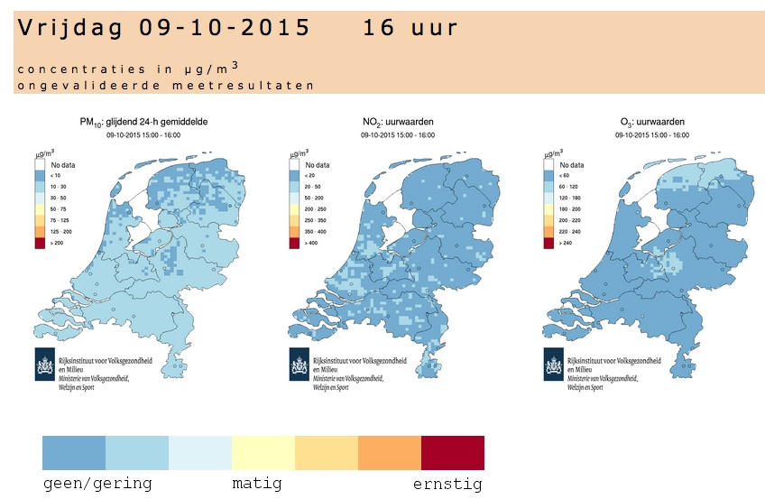
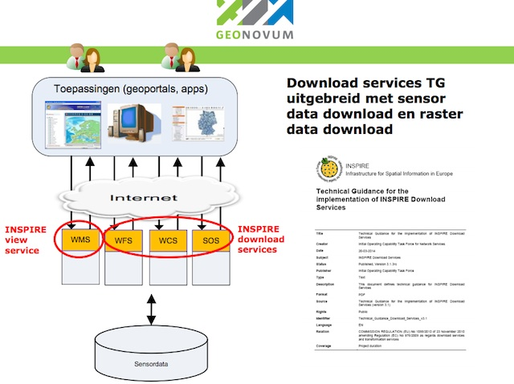
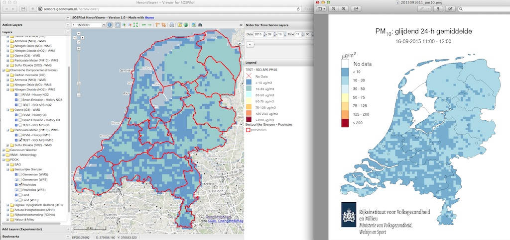
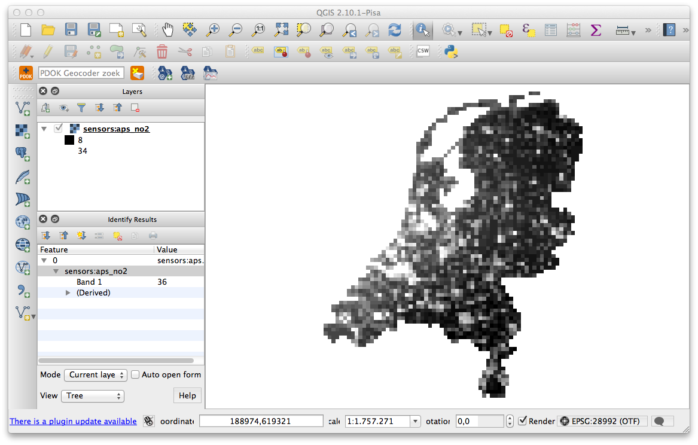

.. _rio:

========================
Applying RIO for AQ Data
========================

Starting in october 2015 the SOSPilot platform was
extended to handle Air Quality data using the RIO model.

RIO is an interpolation method/tool for Air Quality data.
Get a global overview from the `IrCELine website <http://www.irceline.be/nl/documentatie/modellen/rio-ifdm>`_ and
the article `"Spatial interpolation of air pollution measurements using CORINE land cover data" <http://www.irceline.be/~celinair/rio/rio_corine.pdf>`_ for scientific
details.

The RIO tools are used by RIVM, see the
`RIVM website <http://www.rivm.nl/Documenten_en_publicaties/Wetenschappelijk/Rapporten/2014/juni/Verbeterde_actuele_luchtkwaliteitskaarten_Validatie_interpolatiemethode_RIO_Nederland>`_:

*"Het RIVM presenteert elk uur de actuele luchtkwaliteitskaarten voor stikstofdioxide, ozon en fijn stof in Nederland*
*op de website van het Landelijk Meetnet Luchtkwaliteit (LML). Meetgegevens van representatieve LML-locaties worden*
*gebruikt om te berekenen wat de concentraties voor de rest van Nederland, buiten de meetpunten om, zijn. De huidige*
*rekenmethode om deze kaarten te maken, genaamd INTERPOL, heeft een aantal beperkingen. Hierdoor worden bijvoorbeeld*
*stikstofdioxideconcentraties in stedelijk gebied vaak onderschat.*

*In België is een betere interpolatiemethode ontwikkeld. Deze methode, de RIO (residual interpolation optimised for ozone)*
*interpolatiemethode, wordt daar gebruikt voor luchtkwaliteitskaarten die het publiek informeren over de actuele luchtkwaliteit.*
*In 2009 is de RIO interpolatiemethode in opdracht van het RIVM zodanig uitgebreid en aangepast dat hij ook in Nederland kan worden*
*gebruikt."*

A RIO toolkit, has been developed by `VITO <https://vito.be>`_, a leading European independent research and technology organisation
based in Belgium. The toolkit is implemented in `MatLab <http://nl.mathworks.com/products/matlab/>`_. Basically the RIO-tool
converts Air Quality measurement data (CSV) from a set of dispersed stations to country-side coverage data.
RIVM uses RIO to produce and publish `daily maps of Air Quality data <http://www.lml.rivm.nl>`_ for NO2, O3 and PM10, like the image below.

   *Website www.lml.rivm.nl - dispersion maps produced with Rio*

The Plan
========

The plan within the SOSPilot project is as follows:

(1) apply the RIO model/tool to crowd-sourced air quality measurements, in particular from the :ref:`smartemission` Project

(2) unlock RIO output via an `OGC Web Coverage Service (WCS) <http://www.opengeospatial.org/standards/wcs>`_

Once the above setup is working, various use-cases will be established, for example combining
AQ coverage data with other INSPIRE themes like population and Netherlands-Belgium cross-border AQ data dispersion.

WCS is also a protocol for INSPIRE Download Services (together with WFS and SOS). This is also the main reason
for the above plan. The RIO model also uses data from other INSPIRE themes, in particular land coverage (CORINE).

See also an overview in `this presentation (Grothe 2015) <http://www.geonovum.nl/sites/default/files/Michel%20Grothe%20-%20INSPIRE%20sensoren%20en%20luchtkwaliteit.pdf>`_ from which the image below was taken.

   *INSPIRE View and Download Services*

RIO Output Via WCS
==================

This was done as a first step. RIVM has kindly provided us with some RIO input and output datafiles plus documentation.
These can be found `here <https://github.com/Geonovum/sospilot/tree/master/data/rivm-rio>`_. The ``aps2raster`` directory
contains the resulting GeoTIFF files. The work was performed under `this GitHub issue <https://github.com/Geonovum/sospilot/issues/23>`_.

APS Files
---------

RIO output files are text-files in the so-called APS format. An APS file starts with a single line of metadata.
Its format is described `in the APS-header documentation <https://github.com/Geonovum/sospilot/blob/master/data/rivm-rio/doc/APS_header.pdf>`_.
Subsequent lines are the rows forming a 2-dimensional array with the interpolated values.

Below is an example APS header: ::

    # APS Header
    # Y  M  D  H  C   unit  sys   comment  format  proj  orig_x  orig_y  cols rows  pix_w  pix_h
    # 15 9 16 10 NO2 ug/m3 RIO  uurwaarden f7.1    1     0.000   620.000 70    80   4.000  4.000

The metadata gives enough information to construct a GeoTIFF. The most important parameters are

* origin X, Y of coverage
* pixel width and height
* date and time (hour) of the measurements
* the chemical component (here NO2)

The data values are space-separated values. No-values are denoted with ``-999.0`` : ::

	... -999.0   23.4   23.6 -999.0   24.2   17.3   14.3 ...
	...   16.1   17.3   18.4   19.4   21.6   21.9   20.1 ...

Converting to GeoTIFF
---------------------

Developing a simple Python program called `aps2raster.py <https://github.com/Geonovum/sospilot/blob/master/src/rivm-rio/aps2raster.py>`_,
the ``.aps`` files are converted to GeoTIFF files. ``aps2raster.py`` reads an APS file line by line. From the first
line the metadata elements are parsed. From the remaining lines a 2-dimensional array of floats is populated.
Finally a geoTIFF file is created with the data and metadata. Projection is always in RD/EPSG:28992.

WMS with Raster Styling
-----------------------

Using GeoServer the GeoTIFFs are added as datasources and one layer per GeoTIFF is published. Within GeoServer
this automatically creates both a WCS and a WMS layer. As the GeoTIFF does not contain colors but data values
styling is needed to view the WMS layer. This has been done via Styled Layer Descriptor files. In order
to render the same colors as the RIVM LML daily images a value-interval color-mapping was developed as
in this example for NO2: ::

	<FeatureTypeStyle>
	    <FeatureTypeName>Feature</FeatureTypeName>
	    <Rule>
	        <RasterSymbolizer>
	            <ColorMap type="intervals">
	                <ColorMapEntry color="#FFFFFF" quantity="0" label="No Data" opacity="0.0"/>
	                <ColorMapEntry color="#6699CC" quantity="20" label="&lt; 20 ug/m3" opacity="1.0"/>
	                <ColorMapEntry color="#99CCCC" quantity="50" label="20-50 ug/m3" opacity="1.0"/>
	                <ColorMapEntry color="#CCFFFF" quantity="200" label="50-200 ug/m3" opacity="1.0"/>
	                <ColorMapEntry color="#FFFFCC" quantity="250" label="200-250 ug/m3" opacity="1.0"/> <!-- Yellow -->
	                <ColorMapEntry color="#FFCC66" quantity="350" label="250-350 ug/m3" opacity="1.0"/>
	                <ColorMapEntry color="#FF9966" quantity="400" label="350-400 ug/m3" opacity="1.0"/>
	                <ColorMapEntry color="#990033" quantity="20000" label="&gt; 400 ug/m3" opacity="1.0"/>
	            </ColorMap>
	        </RasterSymbolizer>
	    </Rule>
	</FeatureTypeStyle>

The SLD files can be found `here <https://github.com/Geonovum/sospilot/blob/master/src/rivm-rio/sld>`_.

The WMS layers have been added to the existing `SOSPilot Heron viewer <http://sensors.geonovum.nl/heronviewer/>`_.

Comparing with RIVM LML
-----------------------

The resulting WMS layers can be compared to the original PNG files that came with the APS data files.
Below two examples for NO2 and PM10.

For NO2 below.

.. figure:: _static/rivm-rio/aps_no2_compared.jpg
   :align: center

   *Comparing with RIVM LML maps (right) - NO2*

And for PM10 below.

   *Comparing with RIVM LML maps (right) - PM10*

As can be seen the maps are identical. Our WMS-maps are on the right. They
are somewhat "rougher" on the edges since we have not cut-out using the coastlines.

WCS in QGIS
-----------

The Layers published in GeoServer can be viewed in QGIS by adding a WCS Layer via the standard WCS
support in QGIS.

   *INSPIRE View and Download Services*

Viewing Results
===============

Results can be viewed in basically 3 ways:

* as WMS Layers via the Heron Viewer: http://sensors.geonovum.nl/heronviewer
* as WCS in e.q. QGIS http://sensors.geonovum.nl/gs/sensors/wcs?
* as `raw GeoTIFF raster files <https://github.com/Geonovum/sospilot/tree/master/data/rivm-rio/aps2raster>`_

Below some guidance for each viewing method. TBS

Heron Viewer
------------

Go to http://sensors.geonovum.nl/heronviewer

- links staan mappen met kaartlagen
- een heet "Chemische Componenten (Historie)"
- deze openen
- dan bijv submap "Nitrogen Dioxide (NO2) - WMS" openen
- dan de laag "TEST RIO APS NO2" aanvinken

WCS in QGIS
-----------

See above.

