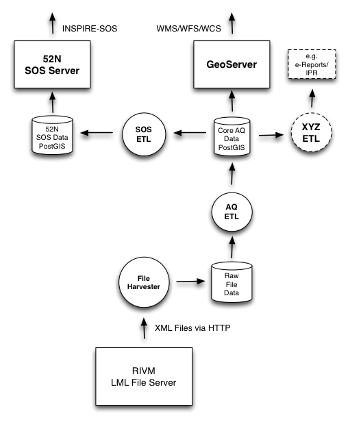
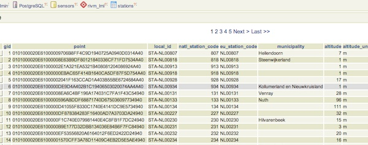
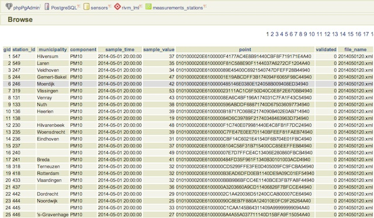
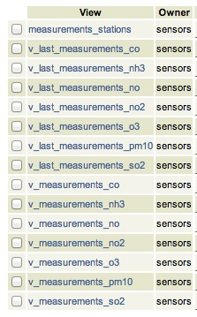
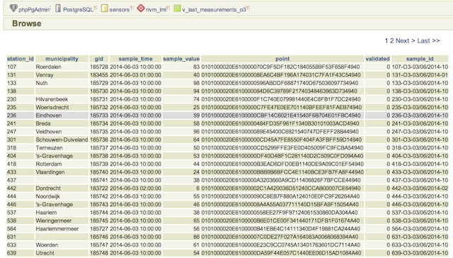
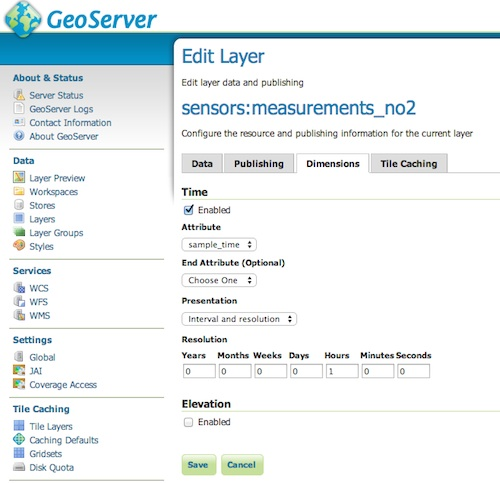
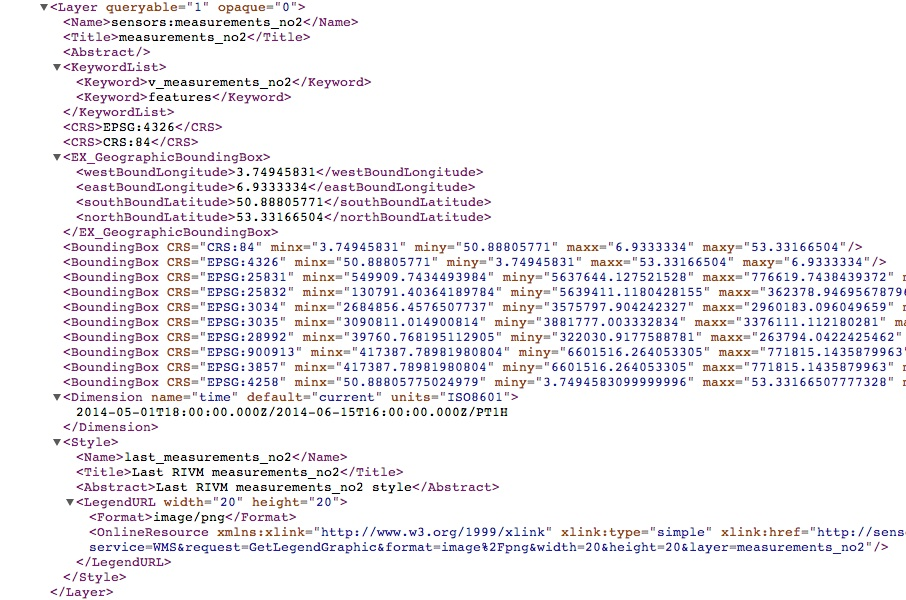
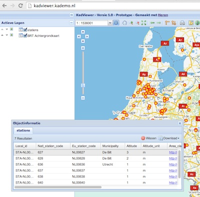
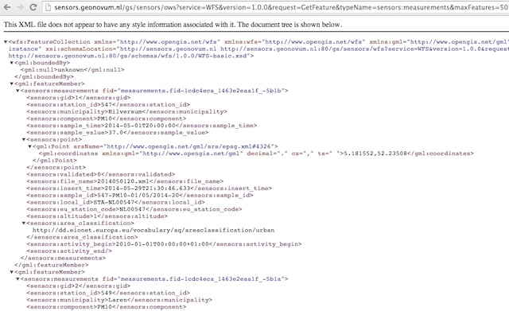
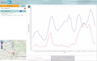

.. _services:

============
Web Services
============

This chapter describes how OGC OWS web services are realized on top of the
converted/transformed data as described in the `data chapter <data.html>`_.
In particular:

* WFS and WMS-Time services
* OWS SOS service

Architecture
============

Figure 1 sketches the overall SOSPilot architecture with emphasis on the flow of data (arrows).
Circles depict harvesting/ETL processes. Server-instances are in rectangles. Datastores
the "DB"-icons.

   *Figure 1 - Overall Architecture*

WFS and WMS Services
====================

This describes the realization of WFS and WMS(-Time) in `GeoServer <http://geoserver.org>`_.
GeoServer can directly generate OWS services from a Postgres/PostGIS datasource as one Layer per Table (or View).
For our purpose the source tables are the
``stations`` table and ``measurements`` tables in the Postgres schema ``rivm-lml``.
See the `data chapter <data.html>`_ for info how these tables are continuously populated from the raw AQ data via
ETL Step 1 and Step 2.

Database VIEWs
~~~~~~~~~~~~~~

As WFS and WMS always need a geometry-column, we will JOIN
the ``stations`` table and the ``measurements`` tables to create 'Postgres VIEWs'.
A VIEW is basically a query but presented as a database table. Data in the VIEW is always current with the original tables
(or VIEWs, as we may derive VIEWs from VIEWs). This way data selections can be provided permanently
and tailored to the particular OWS service.

Having all data (stations, measurements) stored PostgreSQL tables gives rise to many possibilities
for selection from these two tables. The ``stations`` table looks as follows.

   *Figure - RIVM Eionet Stations Read into Postgres/PostGIS*

The sample-data is stored in the ``measurements`` table, as below. ``station_id`` is a foreign key
(though not strictly, as new stations may pop-up) into the ``stations`` table.

.. figure:: _static/lml-measurements-records.jpg
   :align: center

   *Figure - LML raw measurements stored in Postgres*

One appearent VIEW is to combine the ``measurements`` and ``stations`` tables into a new ``measurements_stations``
table by means of a JOIN query as follows (``rivm_lml`` is the schema name): ::

    CREATE VIEW rivm_lml.measurements_stations AS
      SELECT m.gid, m.station_id, s.municipality, m.component, m.sample_time, m.sample_value, s.point, m.validated,
             m.file_name, m.insert_time, m.sample_id,
             s.local_id, s.eu_station_code, s.altitude, s.area_classification,
             s.activity_begin, s.activity_end
             FROM rivm_lml.measurements as m
               INNER JOIN rivm_lml.stations as s ON m.station_id = s.natl_station_code;

The data can now be viewed as rows in the ``measurements_stations`` VIEW, where each sample also has a POINT-geometry:

   *Figure - LML Postgres VIEW of combined measurements and stations*

Still this VIEW is too broad to use for WMS/WFS Layers as we will usually visualize (via WMS) or query (via WFS)
a single chemical component.  We will use the ``measurements-stations`` VIEW  to derive more specialized,
per-component VIEWs Two broad VIEWs are provided first:

* per component last-captured measurements
* per component time-series measurements

These VIEWs are in SQL as below taking two components (NO2 and O3) as example. ::

    -- per component last-captured measurements
    CREATE VIEW rivm_lml.v_last_measurements_NO2 AS
      SELECT DISTINCT ON (station_id) station_id,
        municipality, sample_time, sample_value, point, validated, gid, sample_id
      FROM rivm_lml.measurements_stations WHERE component = 'NO2' ORDER BY station_id, gid DESC;

    CREATE VIEW rivm_lml.v_last_measurements_O3 AS
      SELECT DISTINCT ON (station_id) station_id,
        municipality, sample_time, sample_value, point, validated, gid, sample_id
      FROM rivm_lml.measurements_stations WHERE component = 'O3' ORDER BY station_id, gid DESC;

     .
     .

    -- per component time-series measurements
    CREATE VIEW rivm_lml.v_measurements_NO2 AS
      SELECT  station_id,
        municipality, sample_time, sample_value, point, validated, gid, sample_id
      FROM rivm_lml.measurements_stations WHERE component = 'NO2';

    CREATE VIEW rivm_lml.v_measurements_O3 AS
      SELECT  station_id,
        municipality, sample_time, sample_value, point, validated, gid, sample_id
      FROM rivm_lml.measurements_stations WHERE component = 'O3';
      .
      .

   *Figure - All database views*

Data from these VIEWs can now be viewed as rows like in this table:

   *Figure - LML Postgres VIEW of last measured values at each station for Ozone*

Additional VIEWs
----------------

Additional VIEWs for the future can be thought, like:

* averages
* peak values
* even Voronoi-data can be derived, though that may be expensive: http://smathermather.wordpress.com/2013/12/21/voronoi-in-postgis

These VIEWs can readily applied for WMS with legenda's like here:
http://www.eea.europa.eu/data-and-maps/figures/rural-concentration-map-of-the-ozone-indicator-aot40-for-crops-year-3

GeoServer Service Creation
--------------------------

From the above database VIEWs the WMS/WFS Layers can be created in the GeoServer Admin GUI.
The main items to develop specifically are the Styled Layer Descriptors (SLDs).
The choice is to provide colouring schemes for ranges of values or just labels showing the
values. The latter has been chosen initially.

The challenge is to do something interesting with the Time aspect (field ``sample_time``) as
all features would be positions at the same (station) point coordinates.

For WMS we can use WMS-Time, for WFS we may provide search forms with queries. Other visualizations
may be interesting like Voronoi diagrams: http://smathermather.wordpress.com/2013/12/21/voronoi-in-postgis/.

All OWS services are available from this URL:
http://sensors.geonovum.nl/gs/sensors/ows

The WFS capabilities: http://sensors.geonovum.nl/gs/wfs?request=GetCapabilities

The WMS Capabilities: http://sensors.geonovum.nl/gs/wms?request=GetCapabilities

Within the GeoServer Admin GUI, a PostGIS datastore is added, with the schema ``rivm-lml``.
From there on various wizards and forms will lead to Layer creation and configuration.

WMS TIME Dimension
~~~~~~~~~~~~~~~~~~

The OGC has defined additional WMS 1.3 practises for working with Dimensions, and in particular
with Time and Elevation: https://portal.opengeospatial.org/files/?artifact_id=56394

GeoServer supports these extensions via a 'Dimensions' tab in each Layer configuration.

   *Figure - WMS Configuration for Time Dimension*

The ``sample_time`` date-field is selected, the data is presented as `Interval and resolution' with a resolution
of 1 hour as this is the standard interval for LML measurements.

The Capabilities also show for the ``<component>_measurements`` Layers the Time dimension.
See figure below.

   *Figure - WMS Capabilities Layer with Time Dimension*

Stations Layer
~~~~~~~~~~~~~~

This is quite trivial: a small flat table with station info and a Point geometry.
The WMS layer may be added to a viewer like the KadViewer: http://kadviewer.kademo.nl or
any other GIS package.

   *Figure - GeoServer stations WMS Layer with FeatureInfo*

Measurements Layers
~~~~~~~~~~~~~~~~~~~

These layers are created from the individual per-component VIEWs described above.
For each component there are ``last_measurements_<component>`` and a ``measurements_<component>`` Layers.

Styled Layer Descriptors
~~~~~~~~~~~~~~~~~~~~~~~~

A simplified SLD approach is taken, just circles with a text label for values. More advanced
SLDs may be added later. Here is an example for NO2, both used for the ``measurements_no2`` and ``last_measurements_no2``
layers. ::

    <?xml version="1.0" encoding="ISO-8859-1"?>
    <StyledLayerDescriptor version="1.0.0"
                           xsi:schemaLocation="http://www.opengis.net/sld StyledLayerDescriptor.xsd"
                           xmlns="http://www.opengis.net/sld"
                           xmlns:ogc="http://www.opengis.net/ogc"
                           xmlns:xlink="http://www.w3.org/1999/xlink"
                           xmlns:xsi="http://www.w3.org/2001/XMLSchema-instance">

        <!-- a Named Layer is the basic building block of an SLD document -->
        <NamedLayer>
            <Name>last_measurements_no2</Name>
            <UserStyle>
                <!-- Styles can have names, titles and abstracts -->
                <Title>Last RIVM measurements_no2</Title>
                <Abstract>Last RIVM measurements_no2 style</Abstract>
                <IsDefault>1</IsDefault>
                <!-- FeatureTypeStyles describe how to render different features -->
                <!-- A FeatureTypeStyle for rendering points -->
                <FeatureTypeStyle>
                    <Rule>
                        <PointSymbolizer>
                            <Graphic>
                                <Mark>
                                    <WellKnownName>circle</WellKnownName>
                                    <Fill>
                                        <CssParameter name="fill">#8b008b</CssParameter>
                                        <CssParameter name="fill-opacity">1.0</CssParameter>
                                    </Fill>
                                    <Stroke>
                                        <CssParameter name="stroke">#ee82ee</CssParameter>
                                        <CssParameter name="stroke-width">1</CssParameter>
                                    </Stroke>
                                </Mark>
                                <Size>30</Size>
                            </Graphic>
                        </PointSymbolizer>

                        <TextSymbolizer>
                            <Label>
                                <ogc:PropertyName>sample_value</ogc:PropertyName>
                            </Label>
                            
                                <CssParameter name="font-family">
                                    <ogc:Literal>Lucida Sans Regular</ogc:Literal>
                                </CssParameter>

                                <CssParameter name="font-size">
                                    <ogc:Literal>10</ogc:Literal>
                                </CssParameter>
                                <CssParameter name="font-weight">
                                    <ogc:Literal>bold</ogc:Literal>
                                </CssParameter>
                            
                            <LabelPlacement>
                                <PointPlacement>
                                    <AnchorPoint>
                                        <AnchorPointX>0.5</AnchorPointX>
                                        <AnchorPointY>0.5</AnchorPointY>
                                    </AnchorPoint>
                                </PointPlacement>
                            </LabelPlacement>
                            <Fill>
                                <CssParameter name="fill">#ffffff</CssParameter>
                            </Fill>
                        </TextSymbolizer>
                    </Rule>
                </FeatureTypeStyle>
            </UserStyle>
        </NamedLayer>
    </StyledLayerDescriptor>

These layers can be rendered in any WMS viewer, but in particular viewers that support
the WMS-Time parameter on the client, for example the `HeronViewer <http://sensors.geonovum.nl/heronviewer>`_ developed
for this project. `Heron <http://www.heron-mc.org>`_ is a web mapping client framework
that builds on `OpenLayers <http://openlayers.org>`_ . OL supports WMS Dimensions in general.

.. figure:: _static/heronviewer-2-small.jpg
   :align: center

   *Figure - Heron Viewer showing WMS-T Measurements Layers*

WFS Layers
~~~~~~~~~~

WFS Layers are created automatically for each WMS Layer in GeoServer.
A WFS query can be as follows:

   *Figure - GeoServer measurements Layer WFS query*

SOS Services
============

*"The OGC Sensor Observation Service aggregates readings from live, in-situ and remote sensors.*
*The service provides an interface to make sensors and sensor data archives accessible via an*
*interoperable web based interface."*

The chapter on server administration describes how the 52 North SOS server is deployed. This is
called here the 'SOS Server'.

Different as from GeoServer the 'SOS Server' comes with its own database schema and store.
Via ETL Step 3 as described in the `data <data.html>`_ chapter, the tables are populated
by publishing both sensor and observation data via SOS-Transactions to the SOS Server.
There is no need to, like with GeoServer, to configure SOS services as these are readily available.

The SOS server is available at http://sensors.geonovum.nl/sos

Integration with other SOSs
---------------------------

On June 13, 2014, a first test was performed integrating Air Quality SOSs from Belgium, Holland and Sweden
via the 52 North HTML5 client. This gave a promising result as depicted below.

   *Figure - GeoServer measurements Layer WFS query*

*From: Simon Jirka ....... during the last days, the SOS servers form the Netherlands and also*
*from Sweden went online. We have used this opportunity to connect our*
*client to all three servers and to load Ozone data. Attached you find*
*a screenshot of the result. The data from Sweden is coloured in green,*
*the time series from Belgium is blue and the data from the Netherlands*
*has red colour. Data from the SOS operated by the EEA should follow*
*next week, as well.*

