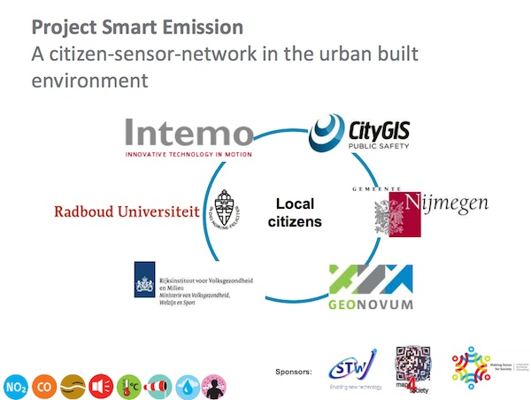
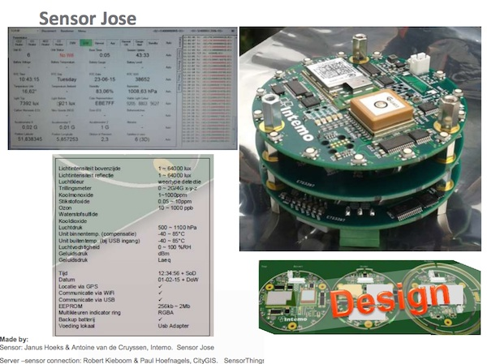
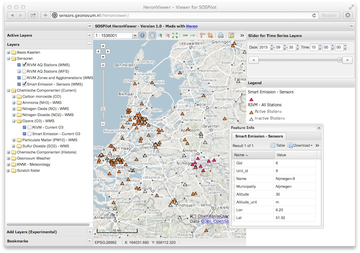
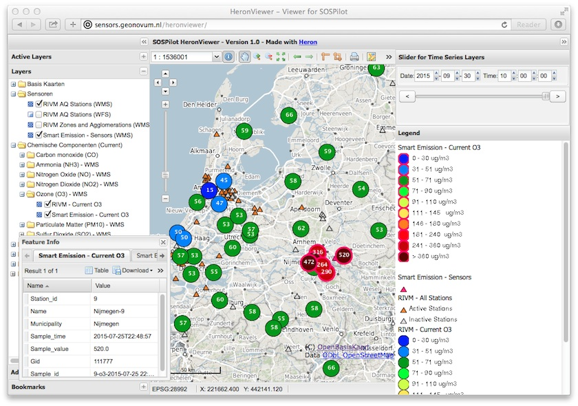
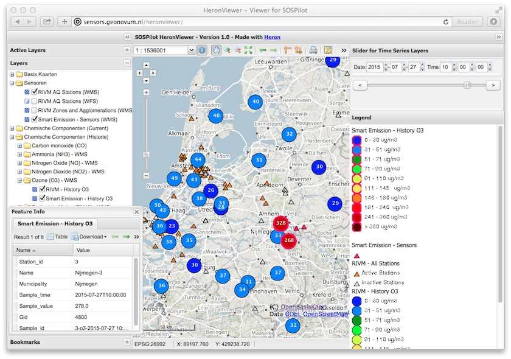
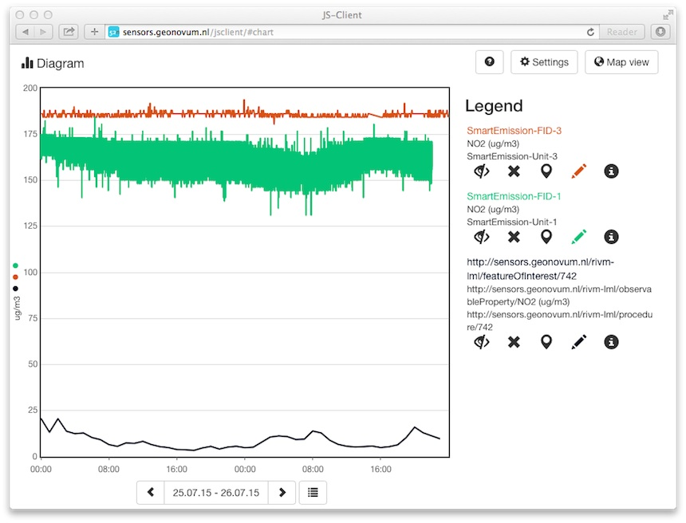
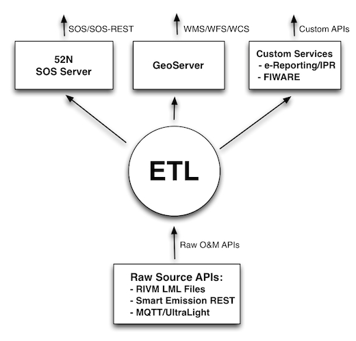
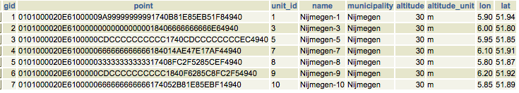
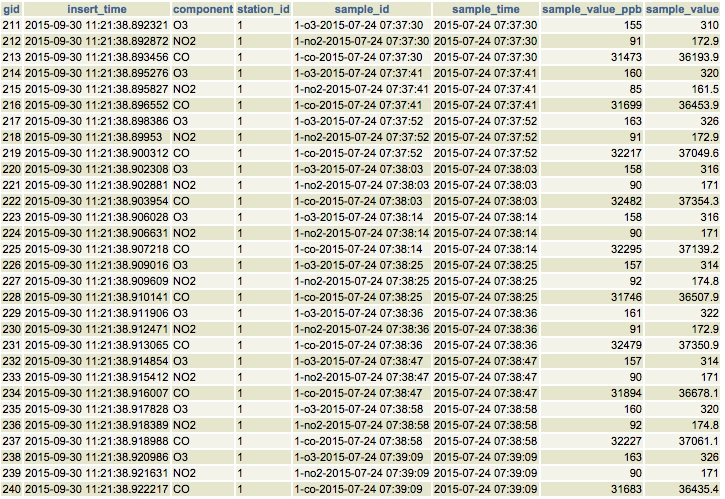
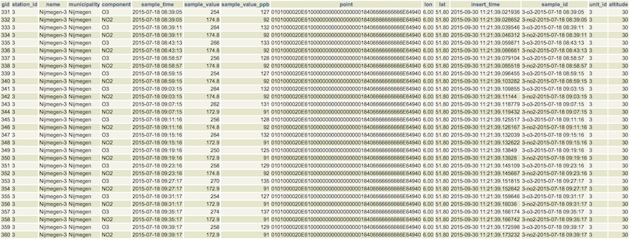

.. _smartemission:

======================
Smart Emission Project
======================

In 2015 the SOSPilot platform was
extended to handle air quality data from
the `Smart Emission (Nijmegen) project <http://www.ru.nl/gpm/onderzoek/research-projects/smart-emission/>`_.
The same ETL components and services (WMS, WFS, SOS) as used for RIVM AQ data could be reused with some small modifications.
Source code for the Smart Emission ETL can be found in
GitHub: https://github.com/Geonovum/sospilot/tree/master/src/smartem

Background
==========

Read more via the project page: `Smart Emission (Nijmegen) project <http://www.ru.nl/gpm/onderzoek/research-projects/smart-emission/>`_.
The figures below were taken from the Living Lab presentation, on June 24, 2015:
http://www.ru.nl/publish/pages/774337/smartemission_ru_24juni_lc_v5_smallsize.pdf

   *Smart Emission Project - Participants*

In the paper `Filling the feedback gap of place-related externalities in smart cities <http://www.ru.nl/publish/pages/774337/carton_etall_aesop-2015_v11_filling_thefeedback_gap_ofexternalities_insmartcities.pdf>`_
the project is described extensively.

*"...we present the set-up of the pilot experiment in project “Smart Emission”,*
*constructing an experimental citizen-sensor-network in the city of Nijmegen. This project, as part of*
*research program ‘Maps 4 Society,’ is one of the currently running Smart City projects in the*
*Netherlands. A number of social, technical and governmental innovations are put together in this*
*project: (1) innovative sensing method: new, low-cost sensors are being designed and built in the*
*project and tested in practice, using small sensing-modules that measure air quality indicators,*
*amongst others NO2, CO2, ozone, temperature and noise load. (2) big data: the measured data forms*
*a refined data-flow from sensing points at places where people live and work: thus forming a ‘big*
*picture’ to build a real-time, in-depth understanding of the local distribution of urban air quality (3)*
*empowering citizens by making visible the ‘externality’ of urban air quality and feeding this into a*
*bottom-up planning process: the community in the target area get the co-decision-making control over*
*where the sensors are placed, co-interpret the mapped feedback data, discuss and collectively explore*
*possible options for improvement (supported by a Maptable instrument) to get a fair and ‘better’*
*distribution of air pollution in the city, balanced against other spatial qualities. ...."*

The Sensor (Sensor Jose) used was developed by Intemo with Server-sensor connection by CityGIS. See below.

   *Smart Emission Project - Sensors*

The data from these sensors was converted and published into standard OGC services: WMS(-Time), WFS and SOS.
This is described in the remainder of this chapter. For readers eager to see the results, these are presented
in the next section. A snapshot of AQ data was provided through `CityGIS <http://citygis.nl">`_ via FTP.

Results
=======

Results can be viewed in basically 3 ways:

* as WMS and WMS-Time Layers via the Heron Viewer: http://sensors.geonovum.nl/heronviewer
* as SOS-data via the SOS Web-Client: http://sensors.geonovum.nl/jsclient
* as raw SOS-data via SOS or easier via the SOS-REST API

Below some guidance for each method.

Heron Viewer
------------

Within the Heron Viewer at http://sensors.geonovum.nl/heronviewer one can view Stations and
Measurements. These are available as standard WMS layers organized as follows:

* a Stations-layer: just the locations and info of all stations (triangles)
* Last Measurements Layers: per-component a Layer showing the last known measurements for each station
* Measurements History Layers: per-component a Layer showing measurements over time for each station

To discern among RIVM LML and Smart Emission data, the latter Stations are rendered as pink-purple icons.
The measurement data (circles) have a pink-purple border.

Stations Layer
~~~~~~~~~~~~~~

See Figure below (pink-purple triangles).

   *Smart Emission Stations in Heron Viewer*

Clicking on a Station provides more detailed info via WMS ``GetFeatureInfo`` in a pop-up window.

Last Measurements Layers
~~~~~~~~~~~~~~~~~~~~~~~~

In the viewer the latest measurements per station can be shown. NB the Smart Emission data may not
be current. LML data is current, i.e. from the last hour.

   *Heron Viewer showing latest known O3 Measurements*

Use the map/folder on the left called "Chemische Componenten (Current)" to open a chemical component. For each component
there are one or two (NO2, CO and O3) layers that can be enabled. Click on a circle to see more detail.

Measurements History Layers
~~~~~~~~~~~~~~~~~~~~~~~~~~~

This shows measurements through time.  NB Smart Emission data is mainly from july/august 2015!

   *Heron Viewer showing O3 Measurements over time with timeslider*

Use the map/folder on the left called "Chemische Componenten (Historie)". For each component
there are one or two (NO2, CO and O3)layers that can be enabled. Click on a circle to see more detail.
Use the TimeSlider on the upper right to go through the history. The image below
shows O3 at July 27, 2015, 10:00. Again pink-purple-bordered circles denote Smart Emission measurements.

SOS Web-Client
--------------

The SOS Web Client by 52North: http://sensors.geonovum.nl/jsclient accesses the SOS directly via the map and charts.

   *SOS Web Client showing NO2 Measurements in Chart*

The viewer is quite advanced and
takes some time to get used to. It is possible to get charts and other views. Best is to follow
the tutorial. Custom charts can be made by selecting stations on the map (Map View) and
adding these. The Smart Emission components are called O3, CO and NO2. The RIVM LML ones have
longer names starting with ``http:``.
As can be seen the Smart Emission measurements are significantly higher.

SOS-REST API
------------

Easiest is looking at results via the `SOS REST API <http://sensorweb.demo.52north.org/sensorwebclient-webapp-stable/api-doc>`_.
The following are examples:

* http://sensors.geonovum.nl/sos/api/v1/stations REST API, Stations
* http://sensors.geonovum.nl/sos/api/v1/phenomena REST API, Phenomena
* http://sensors.geonovum.nl/sos/api/v1/timeseries REST API, All Time Series List
* http://sensors.geonovum.nl/sos/api/v1/timeseries/260 REST API, Single Time Series MetaData
* http://sensors.geonovum.nl/sos/api/v1/timeseries/100/getData?timespan=PT48H/2014-09-06 REST API, Time Series Data
* http://sensors.geonovum.nl/sos/api/v1/timeseries/260/getData?timespan=2015-07-21TZ/2015-07-28TZ REST API, Time Series Data

Architecture
============

Figure 2 sketches the overall SOSPilot architecture with emphasis on the flow of data (arrows).
Circles depict harvesting/ETL processes. Server-instances are in rectangles. Datastores
the "DB"-icons.

   *Figure 2 - Overall Architecture*

Figure 1 sketches the approach for RIVM LML AQ data, but this same approach was used voor Smart Emission. For "RIVM LML File Server" one should read:
"Raw Smart Emission Sample Data".

ETL Design
==========

In this section the ETL is elaborated in more detail as depicted in the figure below.
Figure 3 sketches the approach for RIVM LML AQ data, but this same approach was used voor Smart Emission.
Also here: for "RIVM LML File Server" one should read:
"Raw Smart Emission Sample Data". Step 2 and Step 3 are identical, an advantage of the multi-step ETL process now pays back!
Step 1 was performed more manually, awaiting a similar automated approach.

.. figure:: _static/sospilot-arch1.jpg
   :align: center

   *Figure 3 - Overall Architecture with ETL Steps*

The ETL design comprises three main processing steps and three datastores. The three ETL Steps are:

#. File Harvester: manually (for now) via FTP
#. AQ ETL: transform this local source data to intermediate "Core AQ Data" in PostGIS
#. SOS ETL: transform and publish "Core AQ Data" to the 52N SOS DB via SOS-Transactions (SOS-T)

The detailed dataflow from source to destination is as follows:

#. AQ raw (text) files are placed on the file system (awaiting automated approach)
#. The AQ ETL process (files2measurements) reads these files Core AQ DB (Raw Measurements)
#. The Core AQ DB contains measurements + stations in regular tables 1-1 with original data, including a Time column
#. The Core AQ DB can be used for OWS (WMS/WFS) services via GeoServer (possibly using VIEW by Measurements/Stations JOIN)
#. The SOS ETL process transforms core AQ data to SOS Observations and publishes Observations using SOS-T InsertObservation
#. These three processes run continuously (via cron)
#. Each process always knows its progress and where it needs to resume, even after it has been stopped (by storing a progress/checkpoint info)

These last two ETL processes manage their ``last sync-time`` using a separate ``progress table`` within the database.
The first (Harvester) only needs to check if a particular XML file (as they have a unique file name) has already been stored.

Advantages of this approach:

* backups of source data possible
* incrementally build up of history past the last month
* in case of (design) errors we can always reset the 'progress timestamp(s)' and restart anew
* simpler ETL scripts than “all-in-one", e.g. from “Core AQ DB” to "52N SOS DB" may even be in plain SQL
* migration with changed in 52N SOS DB schema simpler
* prepared for op IPR/INSPIRE ETL (source is Core OM DB)
* OWS server (WMS/WFS evt WCS) can directly use op Core OM DB (possibly via Measurements/Stations JOIN VIEW evt, see below)

The Open Source ETL tool `Stetl, Streaming ETL <http://www.stetl.org>`_  , is used for most of the transformation steps.
Stetl provides standard modules for building an ETL Chain via a configuration file.
This ETL Chain is a linkage of Input, Filter and Output modules. Each module is a Python class
derived from Stetl base classes. In addition a developer
may add custom modules where standard Stetl modules are not available or to specialize processing aspects.

Stetl has been used sucessfully to publish BAG (Dutch Addresses and Buildings) to INSPIRE Addresses via
XSLT and WFS-T (to the ``deegree WFS server``) but also for transformation of Dutch topography (Top10NL and BGT)
to PostGIS. As Stetl is written in Python it is well-integrated with standard ETL and Geo-tools like GDAl/OGR, XSLT and
PostGIS.

At runtime Stetl (via the ``stetl`` command) basically reads the config file,
creates all modules and links their inputs and outputs. This also makes for an easy programming model
as one only needs to concentrate on a single ETL step.

ETL Step 1. - Harvester
-----------------------

The Smart Emission FTP server provides measurements per sensor (unit)
in text files. See figure below. The raw data records per unit are divided
over multiple lines. See example below: ::

	07/24/2015 07:25:41,P.UnitSerialnumber,1
	07/24/2015 07:25:41,S.Longitude,5914103
	07/24/2015 07:25:41,S.Latitude,53949942
	07/24/2015 07:25:41,S.SatInfo,90889
	07/24/2015 07:25:41,S.O3,163
	07/24/2015 07:25:41,S.BottomSwitches,0
	07/24/2015 07:25:41,S.RGBColor,16771990
	07/24/2015 07:25:41,S.LightsensorBlue,92
	07/24/2015 07:25:41,S.LightsensorGreen,144
	07/24/2015 07:25:41,S.LightsensorRed,156
	07/24/2015 07:25:41,S.AcceleroZ,753
	07/24/2015 07:25:41,S.AcceleroY,516
	07/24/2015 07:25:41,S.AcceleroX,510
	07/24/2015 07:25:41,S.NO2,90
	07/24/2015 07:25:41,S.CO,31755
	07/24/2015 07:25:41,S.Altimeter,118
	07/24/2015 07:25:41,S.Barometer,101101
	07/24/2015 07:25:41,S.LightsensorBottom,26
	07/24/2015 07:25:41,S.LightsensorTop,225
	07/24/2015 07:25:41,S.Humidity,48618
	07/24/2015 07:25:41,S.TemperatureAmbient,299425
	07/24/2015 07:25:41,S.TemperatureUnit,305400
	07/24/2015 07:25:41,S.SecondOfDay,33983
	07/24/2015 07:25:41,S.RtcDate,1012101
	07/24/2015 07:25:41,S.RtcTime,596503
	07/24/2015 07:25:41,P.SessionUptime,60781
	07/24/2015 07:25:41,P.BaseTimer,9
	07/24/2015 07:25:41,P.ErrorStatus,0
	07/24/2015 07:25:41,P.Powerstate,79
	07/24/2015 07:25:51,P.UnitSerialnumber,1
	07/24/2015 07:25:51,S.Longitude,5914103
	07/24/2015 07:25:51,S.Latitude,53949942
	07/24/2015 07:25:51,S.SatInfo,90889
	07/24/2015 07:25:51,S.O3,157
	07/24/2015 07:25:51,S.BottomSwitches,0

Each record starts on a line that contains ``P.UnitSerialnumber`` and runs to the next line
containing ``P.UnitSerialnumber`` or the end-of-file is reached. Each record contains
zero to three chemical component values named: ``S.CO`` (Carbon Monoxide), ``S.NO2`` (Nitrogen Dioxide)
or ``S.O3`` (Ozone), and further fields such as location (Latitude, Longitude) and
weather data (Temperature, Pressure). All fields have the same timestamp, e.g. ``07/24/2015 07:25:41``.
This is taken as the timestamp of the record.

According to CityGIS the units are defined as follows. ::

	S.TemperatureUnit		milliKelvin
	S.TemperatureAmbient	milliKelvin
	S.Humidity				%mRH
	S.LightsensorTop		Lux
	S.LightsensorBottom		Lux
	S.Barometer				Pascal
	S.Altimeter				Meter
	S.CO					ppb
	S.NO2					ppb
	S.AcceleroX				2 ~ +2G (0x200 = midscale)
	S.AcceleroY				2 ~ +2G (0x200 = midscale)
	S.AcceleroZ				2 ~ +2G (0x200 = midscale)
	S.LightsensorRed		Lux
	S.LightsensorGreen		Lux
	S.LightsensorBlue		Lux
	S.RGBColor				8 bit R, 8 bit G, 8 bit B
	S.BottomSwitches		?
	S.O3					ppb
	S.CO2					ppb
	S.AudioMinus5			Octave -5 in dB(A)
	S.AudioMinus4			Octave -4 in dB(A)
	S.AudioMinus3			Octave -3 in dB(A)
	S.AudioMinus2			Octave -2 in dB(A)
	S.AudioMinus1			Octave -1 in dB(A)
	S.Audio0				Octave 0 in dB(A)
	S.AudioPlus1			Octave +1 in dB(A)
	S.AudioPlus2			Octave +2 in dB(A)
	S.AudioPlus3			Octave +3 in dB(A)
	S.AudioPlus4			Octave +4 in dB(A)
	S.AudioPlus5			Octave +5 in dB(A)
	S.AudioPlus6			Octave +6 in dB(A)
	S.AudioPlus7			Octave +7 in dB(A)
	S.AudioPlus8			Octave +8 in dB(A)
	S.AudioPlus9			Octave +9 in dB(A)
	S.AudioPlus10			Octave +10 in dB(A)
	S.SatInfo				?
	S.Latitude				*100 + Fractional degrees
	S.Longitude				*10 + Fractional degrees

As stated above: this step, acquiring files is done via FTP.

ETL Step 2 - Raw Measurements
-----------------------------

This step produces raw AQ measurements, "AQ ETL" in Figure 2, from raw source (file) data harvested
in Step 1. The results of this step can be accessed via WMS and WFS, directly in the
project Heron viewer:  http://sensors.geonovum.nl/heronviewer

Two tables: ``stations`` and ``measurements``. This is a 1:1 transformation from the raw text.
The ``measurements`` refers to the ``stations`` by a FK ``unit_id``.

Stations
~~~~~~~~

Station info has been assembled in a CSV file:
https://github.com/Geonovum/sospilot/tree/master/src/smartem/stations.csv ::

	UnitId,Name,Municipality,Lat,Lon,Altitude,AltitudeUnit
	1,Nijmegen-1,Nijmegen,51.94,5.90,30,m
	3,Nijmegen-3,Nijmegen,51.80,6.00,30,m
	5,Nijmegen-5,Nijmegen,51.85,5.95,30,m
	7,Nijmegen-7,Nijmegen,51.91,6.10,30,m
	8,Nijmegen-8,Nijmegen,51.87,5.80,30,m
	9,Nijmegen-9,Nijmegen,51.92,6.20,30,m
	10,Nijmegen-10,Nijmegen,51.89,5.85,30,m

This info was deducted from the raw measurements files. NB: the Lat,Lon values
were inaccurate. This is still under investigation.
**For the sake of the project Lat,Lon values have been randomly altered here!**.
This will need to be corrected at a later stage.

   *Stations Read into Postgres/PostGIS*

Test by viewing in http://sensors.geonovum.nl/heronviewer
See result (pink-purple triangles). Clicking on a station provides more detailed info via WMS ``GetFeatureInfo``.

   *Smart Emission Stations in Heron Viewer*

Measurements
~~~~~~~~~~~~

Reading raw measurements from the files is done with a ``Stetl``
process. A specific Stetl Input module was developed to effect reading and parsing the files
and tracking the last id of the file processed.
https://github.com/Geonovum/sospilot/blob/master/src/smartem/raw2measurements.py

Unit Conversion: as seen above the units for chemical components are in ``ppb`` (Parts-Per-Billion).
For AQ data the usual unit is ug/m3 (Microgram per cubic meter). The conversion
from ppb to ug/m3 is well-known and is dependent on molecular weight, temperature
and pressure. See more detail here: http://www.apis.ac.uk/unit-conversion. Some investigation: ::

	# Zie http://www.apis.ac.uk/unit-conversion
	# ug/m3 = PPB * moleculair gewicht/moleculair volume
	# waar molec vol = 22.41 * T/273 * 1013/P
	#
	# Typical values:
	# Nitrogen dioxide 1 ppb = 1.91 ug/m3  bij 10C 1.98, bij 30C 1.85 --> 1.9
	# Ozone 1 ppb = 2.0 ug/m3  bij 10C 2.1, bij 30C 1.93 --> 2.0
	# Carbon monoxide 1 ppb = 1.16 ug/m3 bij 10C 1.2, bij 30C 1.1 --> 1.15
	#
	# Benzene 1 ppb = 3.24 ug/m3
	# Sulphur dioxide 1 ppb = 2.66 ug/m3
	#

For now a crude approximation as the measurements themselves are also not very accurate (another issue).
In `raw2measurements.py <https://github.com/Geonovum/sospilot/blob/master/src/smartem/raw2measurements.py>`_: ::

	record['sample_value'] = Record2MeasurementsFilter.ppb_to_ugm3_factor[component_name] * ppb_val

with ``Record2MeasurementsFilter.ppb_to_ugm3_factor``: ::

	# For now a crude conversion (1 atm, 20C)
	ppb_to_ugm3_factor = {'o3': 2.0, 'no2': 1.9, 'co': 1.15}

The Stetl process is defined in
https://github.com/Geonovum/sospilot/blob/master/src/smartem/files2measurements.cfg

The invokation of that Stetl process is via shell script:
https://github.com/Geonovum/sospilot/blob/master/src/smartem/files2measurements.sh

The data is stored in the ``measurements`` table, as below. ``station_id`` is a foreign key
into the ``stations`` table.

   *Smart Emission raw measurements stored in Postgres*

Using a Postgres VIEW the two tables can be combined via an ``INNER JOIN`` to provide measurements
with location. This VIEW can be used as a WMS/WFS data source in GeoServer.

   *Postgres VIEW combining measurements and stations (units)*

The VIEW is defined in https://github.com/Geonovum/sospilot/blob/master/src/smartem/db/db-schema.sql: ::

	CREATE VIEW smartem.measurements_stations AS
	   SELECT m.gid, m.station_id, s.name, s.municipality, m.component, m.sample_time, m.sample_value,
	   m.sample_value_ppb, s.point, s.lon, s.lat,m.insert_time, m.sample_id,s.unit_id, s.altitude
	          FROM smartem.measurements as m
	            INNER JOIN smartem.stations as s ON m.station_id = s.unit_id;

ETL Step 3 - SOS Publication
----------------------------

In this step the Raw Measurements data (see Step 2) is transformed to "SOS Ready Data",
i.e. data that can be handled by the 52North SOS server. This is done via
SOS Transaction (SOS-T) services using ``Stetl``.

SOS Publication - Stetl Strategy
~~~~~~~~~~~~~~~~~~~~~~~~~~~~~~~~

As Stetl only supports WFS-T, not yet SOS, a SOS Output module ``sosoutput.py`` was developed derived
from the standard ``httpoutput.py`` module.
See https://github.com/Geonovum/sospilot/blob/master/src/smartem/sosoutput.py (this version was slightly
adapted from the version used for RIVM LML).

Most importantly, the raw Smart Emission Measurements data
from Step 2 needs to be transformed to OWS O&M data. This is done via``substitutable templates``, like the
Stetl config itself also applies. This means we develop files with SOS Requests in which all variable parts get a
symbolic value like ``{sample_value}``. These templates can be found under
https://github.com/Geonovum/sospilot/tree/master/src/smartem/sostemplates in particular

* https://github.com/Geonovum/sospilot/blob/master/src/smartem/sostemplates/insert-sensor.json InsertSensor
* https://github.com/Geonovum/sospilot/blob/master/src/smartem/sostemplates/delete-sensor.json DeleteSensor
* https://github.com/Geonovum/sospilot/blob/master/src/smartem/sostemplates/procedure-desc.xml Sensor ML
* https://github.com/Geonovum/sospilot/blob/master/src/smartem/sostemplates/insert-observation.json InsertObservation

Note that we use JSON for the requests, as this is simpler than XML. The Sensor ML is embedded in the
``insert-sensor`` JSON request.

SOS Publication - Sensors
~~~~~~~~~~~~~~~~~~~~~~~~~

This step needs to be performed only once, or when any of the original Station data (CSV) changes.

The Stetl config https://github.com/Geonovum/sospilot/blob/master/src/smartem/stations2sensors.cfg
uses a Standard Stetl module, ``inputs.dbinput.PostgresDbInput`` for obtaining Record data from a Postgres database. ::

	{{
	  "request": "InsertSensor",
	  "service": "SOS",
	  "version": "2.0.0",
	  "procedureDescriptionFormat": "http://www.opengis.net/sensorML/1.0.1",
	  "procedureDescription": "{procedure-desc.xml}",
	   "observableProperty": [
	    "CO",
	    "NO2",
	    "O3"
	  ],
	  "observationType": [
	    "http://www.opengis.net/def/observationType/OGC-OM/2.0/OM_Measurement"
	  ],
	  "featureOfInterestType": "http://www.opengis.net/def/samplingFeatureType/OGC-OM/2.0/SF_SamplingPoint"
	}}

The SOSTOutput module will expand ``{procedure-desc.xml}`` with the Sensor ML template from
https://github.com/Geonovum/sospilot/blob/master/src/smartem/sostemplates/procedure-desc.xml.

SOS Publication - Observations
~~~~~~~~~~~~~~~~~~~~~~~~~~~~~~

The Stetl config https://github.com/Geonovum/sospilot/blob/master/src/smartem/measurements2sos.cfg
uses an extended Stetl module (``inputs.dbinput.PostgresDbInput``) for obtaining Record data from a Postgres database:
https://github.com/Geonovum/sospilot/blob/master/src/smartem/measurementsdbinput.py.
This is required to track progress in the ``etl_progress`` table similar as in Step 2.
The ``last_id`` is remembered.

The Observation template looks as follows. ::

	{{
	  "request": "InsertObservation",
	  "service": "SOS",
	  "version": "2.0.0",
	  "offering": "SmartEmission-Offering-{unit_id}",
	  "observation": {{
	    "identifier": {{
	      "value": "{sample_id}",
	      "codespace": "http://www.opengis.net/def/nil/OGC/0/unknown"
	    }},
	    "type": "http://www.opengis.net/def/observationType/OGC-OM/2.0/OM_Measurement",
	    "procedure": "SmartEmission-Unit-{unit_id}",
	    "observedProperty": "{component}",
	    "featureOfInterest": {{
	      "identifier": {{
	        "value": "SmartEmission-FID-{unit_id}",
	        "codespace": "http://www.opengis.net/def/nil/OGC/0/unknown"
	      }},
	      "name": [
	        {{
	          "value": "{municipality}",
	          "codespace": "http://www.opengis.net/def/nil/OGC/0/unknown"
	        }}
	      ],
	      "geometry": {{
	        "type": "Point",
	        "coordinates": [
	          {lat},
	          {lon}
	        ],
	        "crs": {{
	          "type": "name",
	          "properties": {{
	            "name": "EPSG:4326"
	          }}
	        }}
	      }}
	    }},
	    "phenomenonTime": "{sample_time}",
	    "resultTime": "{sample_time}",
	    "result": {{
	      "uom": "ug/m3",
	      "value": {sample_value}
	    }}
	  }}
	}}

It is quite trivial in ``sosoutput.py`` to substitute these values from the ``measurements``-table records.

Like in ETL Step 2 the progress is remembered in the table ``rivm_lml.etl_progress`` by updating the ``last_id`` field
after publication, where that value represents the ``gid`` value of ``rivm_lml.measurements``.

SOS Publication - Results
~~~~~~~~~~~~~~~~~~~~~~~~~

Via the standard SOS protocol the results can be tested:

* GetCapabilities: http://sensors.geonovum.nl/sos/service?service=SOS&request=GetCapabilities
* DescribeSensor (station 807, Hellendoorn): http://tinyurl.com/mmsr9hl  (URL shortened)
* GetObservation: http://tinyurl.com/ol82sxv (URL shortened)

Easier is looking at results via the `SOS REST API <http://sensorweb.demo.52north.org/sensorwebclient-webapp-stable/api-doc>`_.
The following are examples:

* http://sensors.geonovum.nl/sos/api/v1/stations REST API, Stations
* http://sensors.geonovum.nl/sos/api/v1/phenomena REST API, Phenomena
* http://sensors.geonovum.nl/sos/api/v1/timeseries REST API, All Time Series List
* http://sensors.geonovum.nl/sos/api/v1/timeseries/260 REST API, Single Time Series MetaData
* http://sensors.geonovum.nl/sos/api/v1/timeseries/100/getData?timespan=PT48H/2014-09-06 REST API, Time Series Data
* http://sensors.geonovum.nl/sos/api/v1/timeseries/260/getData?timespan=2015-07-21TZ/2015-07-28TZ REST API, Time Series Data
                     

