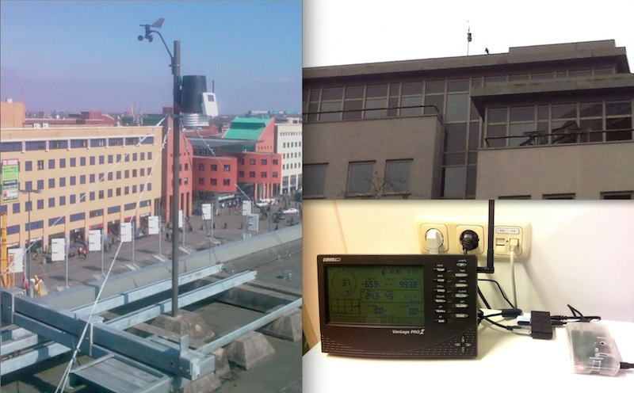
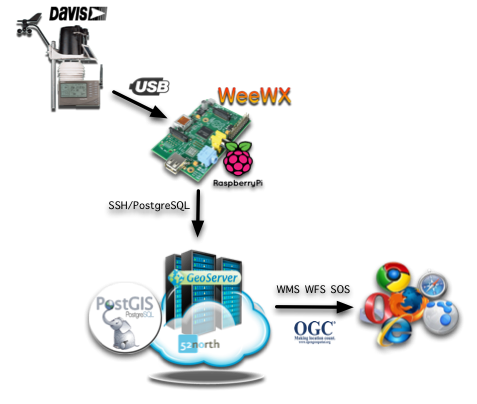
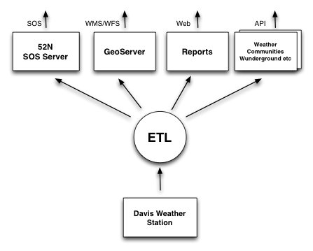
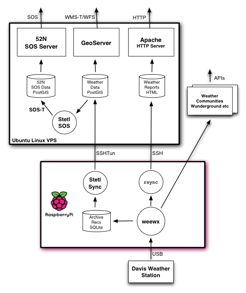
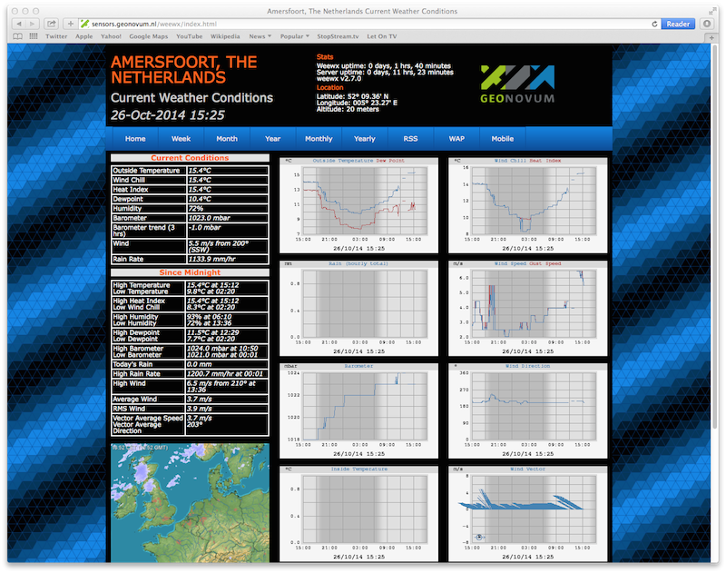
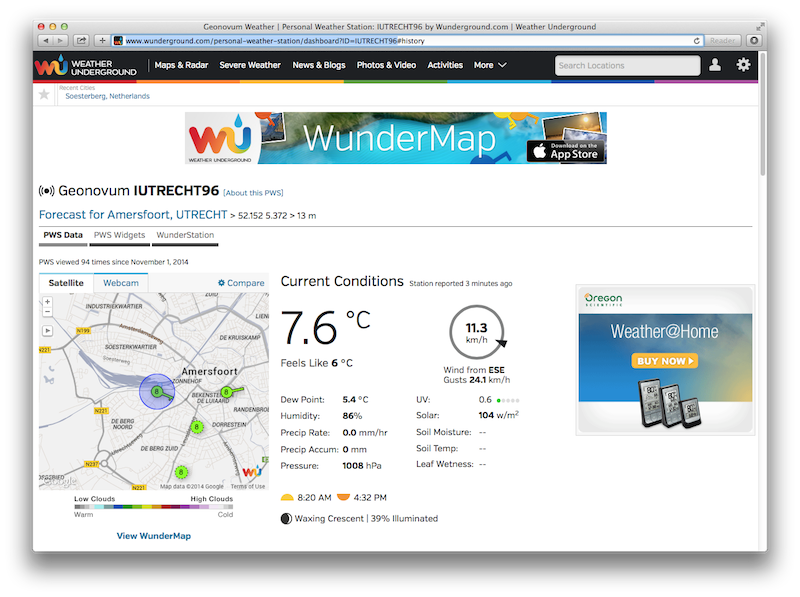
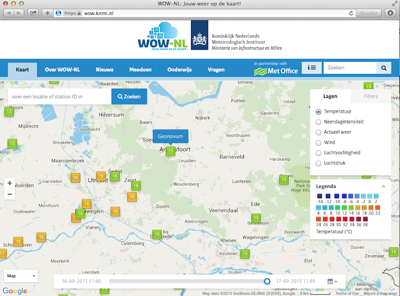
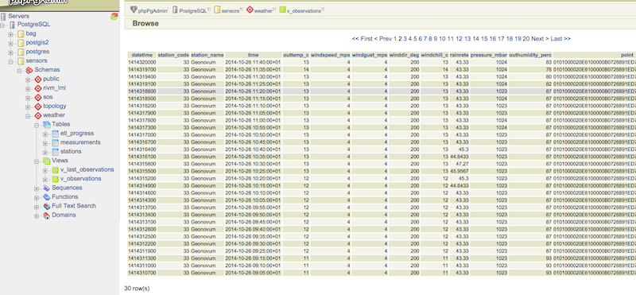
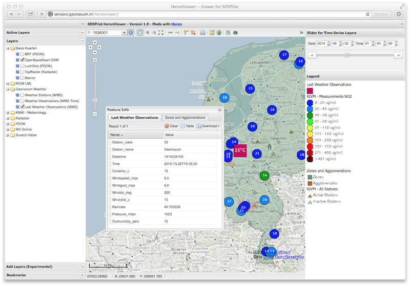

.. _weatherstation:

Weather Station
===============

This chapter describes the hard/software setup of a weather station whose measurements are
to be exposed via OGC protocols like WMS, WFS and in particular SOS.

Introduction
------------

In 2008/2009 Geonovum acquired a
`Davis Vantage Pro II Weather station <http://www.davisnet.com/weather/products/vantage-pro-professional-weather-stations.asp>`_.
This station was/is mounted on the roof of Geonovum building. The outside station-sensors measure
barometric pressure, temperature, humidity, rainfall, wind speed and direction. Data is continuously
sent (wireless, via RF) to a base station, a.k.a. the "console". The console
has a `Davis WeatherLink® <http://www.davisnet.com/weather/products/weather-reporting-software.asp>`_
hard/software add-on that is able to act as a data-logger and provides connectivity over USB.

Data from the weather station was extracted and published to the 52N SOS via a special purpose
PC application. The results of this project have been described in
a `Geo-Info magazine article (2010-1) <http://www.geo-info.nl/download/?id=15311409&download=1>`_.

As part of the SOSPilot project, we will now "revive" the Davis
Weather station and connect its data stream to the SOSPilot infrastructure simliar
to the RIVM AQ datastream. Eventually, the goal is to expose the station weather data to OGC services like
WMS, WFS and in particular SOS.

   *Figure 0 - Geonovum Davis VP2 Weather Station and Console connected to RPi*

As we cannot connect the weather base station (USB),
directly to the SOSPilot server "in the cloud",
an intermediate "middleman" hard/software component will be required.
The main functions of this component are to acquire data from the base station and to
transform and publish this data to the SOSPilot server (VPS).

To this end a `Raspberry Pi <http://www.raspberrypi.org/>`_ (RPi) microcomputer has been chosen.
The RPi is a cheap (around $25,-) credit-card-sized microcomputer that can run free OS-es like Linux (`Raspbian <http://www.raspbian.org/>`_,
a Debian version)
and allows connectivity to USB, WIFI, GSM etc. The RPi is
`popular with weather amateurs <https://www.google.nl/search?q=Raspberry+Pi+Weather+Station&oq=Raspberry+Pi+Weather+Station>`_
(and various other IoT projects as well).

Overview
--------

The overall architecture is depicted below.

   *Figure 1 - Global Setup from Weather Station Through OGC Services*

These components and their interconnections operate as follows.

The Davis weather station is connected to a `Raspberry Pi <http://www.raspberrypi.org/>`_ (RPi) micro computer via
USB trough the `Davis WeatherLink® <http://www.davisnet.com/weather/products/weather-reporting-software.asp>`_.

The RPi runs the `Raspbian <http://www.raspbian.org/>`_ OS with the weather data software
`weewx <http://weewx.com>`_.  The weewx daemon continuously reads raw weather sample data from the Davis weather station
and stores this data locally in a (SQLite or MySQL) database. These measurements, called weewx `Archive Records` are
typically a 5-minute summary of multiple samples (weewx `Loop Records`) collected every few seconds.

An ETL process based on `Stetl <http:/www.stetl.org>`_ transforms and syncs data
from the SQLite `weather archive database` to a remote PostgreSQL server
in a "Cloud Server" (the Ubuntu VPS used in the project).

Other weewx plugins generate reports with statistics and summaries. These are synced regularly to be viewed
as webpages in a browser.

The VPS runs GeoServer to serve the weather data directly from the Postgres/PostGIS
database, using specialized PostgreSQL VIEWs, as WMS, WMS-Time and WFS.

In addition the VPS runs a Stetl ETL process that transforms and and publishes
the weather data from PostgreSQL using the SOS-T protocol
to the 52North Sensor Web Application server.
The latter provides a SOS (Sensor Observation Service). Via the web browser various WMS/WFS
and SOS client applications are invoked.

All client applications
can be found and accessed via the project landing page: `sensors.geonovum.nl <http://sensors.geonovum.nl>`_:

* weather reports via: `sensors.geonovum.nl/weewx <http://sensors.geonovum.nl/weewx>`_
* WMS/WMS-Time/WFS via: `sensors.geonovum.nl/heronviewer <http://sensors.geonovum.nl/heronviewer>`_
* SOS via SOS client apps: `sensors.geonovum.nl <http://sensors.geonovum.nl>`_

The next sections will expand on this overview.

Architecture
------------

The global architecture is depicted below. In all figures in this section the arrows denote the flow of (weather) data.
Circles denote continuous data transformation processes. Rectangles denote application servers or services.

The figure below depicts the software architecture at the global level.
ETL (Extract, Transform, Load) processes extract and transform raw weather data from the Davis weather station
and publish the transformed data to a variety of application servers/services. Each of these servers/services
will provide standard (web) APIs through which client applications can fetch (weather) data.

   *Figure 2 - Global Software Architecture*

* SOS via the `52N SOS application server  <http://52north.org/communities/sensorweb/sos/>`_
* WMS/WMS-Time/WFS via: `GeoServer <http://geoserver.org>`_
* weather reports via standard Apache webserver
* weather APIs via weather-communities like `Weather Underground <http://www.wunderground.com>`_

This global architecture from Figure 2 is expanded into a more detailed design in Figure 3.
This shows the various software and storage components, in particular the realization of the
ETL-processing.

   *Figure 3 - Detailed Software Architecture*

The (data) flow in Figure 3 is as follows.

* data is sampled by the ``weewx`` daemon from the Davis Weather station
* weewx stores `archive records` in a SQLite database
* the `Stetl Sync` process reads the latest data from SQLite database
* `Stetl Sync` publishes these records unaltered to a PostgreSQL database (table: ``measurements``)
* several specialized PostgreSQL VIEWs will filter and convert the raw archive data and JOIN data records with the ``stations`` (location) table date
* the PostgreSQL database (VIEWs) serve directly as data sources for GeoServer WMS/WFS Layers
* GeoServer will also provide a WMS-Dimension (-Time) service using the record timestamp column
* the `Stetl SOS` process reads data from PostgreSQL and transforms this data to SOS-T requests, POSTing these via SOS-T to the 52North SOS
* ``weewx`` also creates and publishes weather data reports in HTML to be serverd by an Apache server
* in addition ``weewx`` may publish weather data to various weather community services like `Weather Underground <http://www.wunderground.com>`_ (optional)

The above components are divided over two server machines.

* the Raspberry Pi: ``weewx`` and  `Stetl Sync`
* the Ubuntu Linux VPS: GeoServer, SOS server and Apache server plus the PostgreSQL/PostGIS database and the `Stetl SOS` ETL

Connections between the RPi and the VPS are via SSH. An SSH tunnel (``SSHTun``) is maintained
to provide a secure connection to the PostgreSQL server on the VPS. This way the PostgreSQL server
is never exposed directly via internet. Each of these components are elaborated further below.

Sources for this architecture can be found in GitHub.

* ETL, database and services: https://github.com/Geonovum/sospilot/tree/master/src/weather
* Raspberry Pi system setup: https://github.com/Geonovum/sospilot/tree/master/src/raspberry
* weewx-specific: https://github.com/Geonovum/sospilot/tree/master/src/weewx

In addition, weewx will be configured to report weather data to the Weather Underground personal weather
station network at http://www.wunderground.com.

Raspberry Pi
------------

A Raspberry Pi will be setup as a headless (no GUI) server. Via a USB Cable the Pi will be connected to the Davis datalogger cable.
The Pi will run a Debian Linux version (Raspbian) with the free `weewx` weather server and
archiver. `weewx` will fetch samples from the Davis weather station, storing its summaries regularly (typically every 5 mins) in
a MySQL or SQLite `archive table`. weewx can also can publish data to community Weather networks like Wunderground.

.. figure:: _static/rasp-pi-all-s.jpg
   :align: center

   *Figure 4 - Raspberry Pi Package through Install*

See the `raspberrypi-install section <raspberrypi-install.html>`_ for the full hardware setup and software installation
of the RPi for the project.

Weather Software
----------------

The choice is `weewx <http://www.weewx.com>`_ with SQLite. `weewx` is installed as part of the
`raspberrypi-install <raspberrypi-install.html>`_. The `weewx` configuration for the Davis station
is maintained in
GitHub https://github.com/Geonovum/sospilot/tree/master/src/weewx/davis. After a first test
using our WeatherStationAPI custom driver, the Geonovum Davis weather station will be connected.

The web reporting is synced by `weewx` every 5 mins to to our main website (using ``rsync`` over SSH):
http://sensors.geonovum.nl/weewx. This will take about 125kb each 5 mins.

   *Figure 5 - weewx standard report screenshot*

In addition `weewx` has been configured to report to the Weather Underground community site.
The station is registered as **IUTRECHT96**, http://www.wunderground.com/personal-weather-station/dashboard?ID=IUTRECHT96.

   *Figure 6a - Geonovum station on Weather Underground*

Also, `weewx` has been configured (in sept 2015) to report to the MET UK Weather Observations Website (WOW).
The station is registered with WOW site ID **929236001**, http://wow.metoffice.gov.uk/sitehandlerservlet?requestedAction=READ&siteID=929236001.
The Dutch KNMI has a localized version, called `WOW-NL <https://wow.knmi.nl/>`_.

   *Figure 6b - Geonovum station on KNMI Weather Observations Website (WOW-NL)*

PostgreSQL Database
-------------------

The PostgreSQL database plays a central role. The 52North SOS will maintain its own tables.
For the Stetl ETL and GeoServer datasources the following tables and VIEWs are created in the ``weather``
schema. ::

    DROP SCHEMA weather CASCADE;
    CREATE SCHEMA weather;

    -- Raw measurements table - data from weewx weather archive or possibly other source
    -- all units in US metrics assumed!
    DROP TABLE IF EXISTS weather.measurements CASCADE;
    CREATE TABLE weather.measurements (
      dateTime             INTEGER NOT NULL UNIQUE PRIMARY KEY,
      station_code         INTEGER DEFAULT 33,
      usUnits              INTEGER NOT NULL,
      interval             INTEGER NOT NULL,
      barometer            REAL,
      pressure             REAL,
      altimeter            REAL,
      inTemp               REAL,
      outTemp              REAL,
      inHumidity           REAL,
      outHumidity          REAL,
      windSpeed            REAL,
      windDir              REAL,
      windGust             REAL,
      windGustDir          REAL,
      rainRate             REAL,
      rain                 REAL,
      dewpoint             REAL,
     .
     .
     .
    );

    --
    -- Name: stations; Type: TABLE; Schema: weather; Owner: postgres; Tablespace:
    --
    DROP TABLE IF EXISTS weather.stations CASCADE;
    CREATE TABLE weather.stations (
        gid integer NOT NULL UNIQUE PRIMARY KEY,
        point geometry (Point,4326),
        wmo character varying,
        station_code integer,
        name character varying,
        obs_pres integer,
        obs_wind integer,
        obs_temp integer,
        obs_hum integer,
        obs_prec integer,
        obs_rad integer,
        obs_vis integer,
        obs_clouds integer,
        obs_presweather integer,
        obs_snowdepth integer,
        obs_soiltemp integer,
        lon double precision,
        lat double precision,
        height double precision
    );

    CREATE INDEX stations_point_idx ON stations USING gist (point);

    INSERT INTO weather.stations (gid, point, wmo, station_code, name, obs_pres, obs_wind, obs_temp, obs_hum, obs_prec, obs_rad, obs_vis, obs_clouds, obs_presweather, obs_snowdepth, obs_soiltemp, lon, lat, height)
    VALUES (1, ST_GeomFromText('POINT(5.372 52.152)', 4326), 'Davis Vantage Pro2', 33,'Geonovum',	1,1,	1,	1,	1,	0,	0,	0,	0,	0,	0, 5.372, 52.152, 32.4);

    -- VIEWS

    -- SELECT to_timestamp(datetime), "datetime","pressure","outtemp" FROM "weather"."measurements"
    DROP VIEW IF EXISTS weather.v_observations CASCADE;
    CREATE VIEW weather.v_observations AS
      SELECT
        meas.datetime,
        meas.station_code,
        stations.name as station_name,
        to_timestamp(datetime) as time,
        round(((outtemp-32.0)*5.0/9.0)::numeric) as outtemp_c,
        round((windSpeed*1.61)/3.6::numeric) as windspeed_mps,
        round((windGust*1.61)/3.6::numeric) as windgust_mps,
        round(windDir::numeric) as winddir_deg,
        round(((windchill-32.0)*5.0/9.0)::numeric) as windchill_c,
        meas.rainRate,
        round((pressure*33.8638815)::numeric) as pressure_mbar,
        round(outhumidity::numeric) as outhumidity_perc,
        stations.point as point
      FROM weather.measurements as meas
      INNER JOIN weather.stations AS stations
          ON meas.station_code = stations.station_code ORDER BY datetime DESC;

    -- Laatste Metingen per Station
    DROP VIEW IF EXISTS weather.v_last_observations CASCADE;
    CREATE VIEW weather.v_last_observations AS
      SELECT DISTINCT ON (station_code) station_code,
        station_name,
        datetime,
        time,
        outtemp_c,
        windspeed_mps,
        windgust_mps,
        winddir_deg,
        windchill_c,
        rainRate,
        pressure_mbar,
        outhumidity_perc,
        point
      FROM weather.v_observations;

The raw weather data is stored in the ``measurements`` table (US units).
In order to make the tables/VIEWs geospatially enabled, a ``stations`` table is added.
The stations table is modeled after existing KNMI station data. Only a single station is
added for now, the Geonovum Davis station. The ``measurements`` table has a ``station_code``
column to facilitate JOINs with the ``stations`` table.

Via VIEWs more simple and geospatially-enabled data is created. Also the VIEWs take
care of conversion from US to metric units. The ``weather.v_observations`` VIEW contains
a selection of weather characteristics joined with station data. ``weather.v_last_observations``
contains the last (current) observations per station. Below an example of data in the
view.

   *Figure 7 - PostgreSQL weather.v_observations VIEW*

Stetl Sync
----------

This section describes the `Stetl Sync` processing within the RPi. Effectively
this process will synchronize the latest data from the ``weewx`` database to
a remote PostgreSQL database on the VPS.

All `sources can be found here <https://github.com/Geonovum/sospilot/tree/master/src/weather/weewx2pg>`_.

`weewx` stores 'archive' data within a SQLite DB file `weewx.sdb`. Statistical
data is derived from this data. Within `weewx.sdb` there is a single table `archive`.
The database/table structure (only relevant fields shown). ::

    CREATE TABLE archive (
        dateTime INTEGER NOT NULL UNIQUE PRIMARY KEY,
        usUnits INTEGER NOT NULL,
        interval INTEGER NOT NULL,
        barometer REAL, 
        pressure REAL, 
        altimeter REAL, 
        inTemp REAL,
        outTemp REAL, 
        inHumidity REAL, 
        outHumidity REAL,
        windSpeed REAL, 
        windDir REAL, 
        windGust REAL, 
        windGustDir REAL, 
        rainRate REAL, 
        rain REAL, 
        dewpoint REAL, 
        windchill REAL,
        ....
    );

Most of the Stetl Sync processing can be realizeed with standard Stetl components like for SQLite input and PostgreSQL
publishing. Only synchronization tracking needs a small Stetl input
component `WeewxDBInput <https://github.com/Geonovum/sospilot/blob/master/src/weather/weewx2pg/weewxdbinput.py>`_.
This component keeps track of the `last archive data record synced` within a PostgreSQL record. At a later stage
this may also become a Stetl component so the complete ETL could be effected in Stetl.

The Stetl config is as follows. ::

    # weewx archive data in SQLite to Postgres/PostGIS output - Stetl config
    #
    # Just van den Broecke - 2014
    #
    # Incrementally reads raw weewx archive records and publishes these to
    # PostGIS.

    # The main Stetl ETL chain
    [etl]
    chains = input_weewx_db|output_postgres_insert

    # for reading files from weewx SQLite, tracking progress in Postgres
    [input_weewx_db]
    class = weewxdbinput.WeewxDbInput
    host = {host}
    port = {port}
    database = {database}
    user = {user}
    password = {password}
    schema = {schema}
    progress_query = SELECT * from etl_progress WHERE worker = 'weewx2postgres'
    progress_update = UPDATE etl_progress SET last_id = %d, last_time = '%s', last_update = current_timestamp WHERE worker = 'weewx2postgres'
    table = archive
    query = SELECT * from archive WHERE dateTime > %d ORDER BY dateTime LIMIT 100
    database_name = {weewx_db}
    output_format = record_array

    [output_std]
    class = outputs.standardoutput.StandardOutput

    # For inserting file records
    [output_postgres_insert]
    class = outputs.dboutput.PostgresInsertOutput
    input_format = record_array
    host = {host}
    database = {database}
    user = {user}
    password = {password}
    schema = {schema}
    table = {table}
    key=dateTime

The target table is the PostgreSQL ``weather.measurements`` table depicted above.

The synchronization state is tracked in a PostgresQL table. A single `worker` (see Stetl config above)
is inserted as well::

    -- ETL progress tabel, houdt bij voor ieder ETL proces ("worker") wat het
    -- laatst verwerkte record id is van hun bron tabel.
    DROP TABLE IF EXISTS weather.etl_progress CASCADE;
    CREATE TABLE weather.etl_progress (
      gid          SERIAL,
      worker       CHARACTER VARYING(25),
      source_table CHARACTER VARYING(25),
      last_id      INTEGER,
      last_time    CHARACTER VARYING(25) DEFAULT '-',
      last_update  TIMESTAMP,
      PRIMARY KEY (gid)
    );

    -- Define workers
    INSERT INTO weather.etl_progress (worker, source_table, last_id, last_update)
      VALUES ('weewx2postgres', 'sqlite_archive', 0, current_timestamp);

The Stetl Sync process is scheduled via ``cron`` to run typically every 4 minutes. ::

    # Cronfile for ETL processes on Raspberry Pi

    SHELL=/bin/sh
    PATH=/usr/local/sbin:/usr/local/bin:/sbin:/bin:/usr/sbin:/usr/bin
    SOSPILOT=/opt/geonovum/sospilot/git

    # Run ETL step 1: Raw weewx data from SQLite to remote Postgres DB on VPN
    */4 * * * * cd $SOSPILOT/src/weather/weewx2pg; ./pi-etl.sh >> /var/log/sospilot/weewx2pg.log 2>&1

The ``pi-etl.sh`` shell-script will first setup an SSH tunnel, then call the Stetl-wrapper ``weewx2pg.sh`` and
then tear down the SSH-tunnel. ::

    #!/bin/bash
    #
    # Script to invoke ETL on the Raspberry Pi
    # Uses an SSH tunnel to connect to Postgres on the VPS
    #

    # Kill possible (hanging) background SSH tunnel
    function killTunnel() {
        pstree -p sadmin | grep 'ssh(' | cut -d'(' -f2 | cut -d')' -f1|xargs kill -9 > /dev/null 2>&1
    }

    # Kill possible (hanging) background SSH tunnel
    killTunnel

    # Setup SSH tunnel to remote host
    ssh -f -L 5432:sensors:5432 sadmin@sensors -4 -g -N
    sleep 10
    ps aux | grep 5432

    # Do the ETL
    ./weewx2pg.sh

    # Kill the background SSH tunnel
    killTunnel

The ``weewx2pg.sh`` script is as follows. ::

    #!/bin/bash
    #
    # ETL for converting/harvesting weewx archive data into PostGIS
    #

    # Usually requried in order to have Python find your package
    export PYTHONPATH=.:$PYTHONPATH

    stetl_cmd=stetl

    # debugging
    # stetl_cmd=../../../../stetl/git/stetl/main.py

    # Set Stetl options

    . ../options.sh

    $stetl_cmd -c weewx2pg.cfg -a "$options"

The ``options.sh`` script will set various (shell) variables to be substituted in the Stetl
config. ::

    #!/bin/sh
    #
    # Sets host-specific variables
    # To add your localhost add options-<your hostname>.sh in this directory

    # All file locations are relative to the specific ETL subdirs like weewx2pg
    . ../options-`hostname`.sh

    export options="host=localhost port=5432 weewx_db=$WEEWX_DB user=$PGUSER password=$PGPASSWORD database=sensors schema=weather table=measurements"

By calling the ``options-<hostname>.sh`` script, various host-specific/secured variables are set.

GeoServer
---------

The ``stations`` table and two VIEWs are used as data sources for weather-layers:

* ``weather.stations`` as a source for a WMS Layer ``sensors:weather_stations``
* ``weather.v_observations`` as a source for a timeseries WMS-Dimension Layer ``sensors:weather_observations`` using continuous interval option
* ``weather.v_last_observations``  for a WMS last observation layer ``sensors:weather_last_observations``

These three layers were easily integrated in the `SOSPilot Heron Viewer <http://sensors.geonovum.nl/heronviewer/>`_.

   *Figure 8 - Weather Data WMS Layers in Heron viewer*

Stetl SOS
---------

This ETL process reads measurements from PostgreSQL and transforms/publishes these to the SOS via SOS-T.
The design Similar to the RIVM LML AQ SOS publishing setup.

Source code: https://github.com/Geonovum/sospilot/tree/master/src/weather/pg2sos

As the weather data is published in the same SOS as the AQ data, both data types can be combined in
any of the SOS browser clients. An example can be seen in Figure 8: both outside temperature (deg) and humidity (%) are
combined with NO2 (Nitrogen Dioxide) and PM10 (Particulate Matter up to 10 micrometers in size).

.. figure:: _static/aq-weather-sshot-52n-client.png
   :align: center

   *Figure 9 - Weather Data SOS Data integrated in 52N JS Client*

Test with SOS requests:
**NB The SOS is not active anymore**

* Station: `DescribeSensor <http://sensors.geonovum.nl/sos/service?service=SOS&version=2.0.0&request=DescribeSensor&procedure=http://sensors/weather/procedure/33&procedureDescriptionFormat=http://www.opengis.net/sensorML/1.0.1>`_
* Temperature observations: `GetObservation <http://sensors.geonovum.nl/sos/service?service=SOS&version=2.0.0&request=GetObservation&offering=http://sensors/weather/offering/33&observedProperty=http://sensors/weather/obsProperty/outtemp>`_

Links
-----

* `RGI-189 Sensoren als databronnen aan de geo-informatie infrastructuur`, Wiel Wauben, KNMI http://www.knmi.nl/~wauben/HIM/SWE%20KNMI%20evaluatie%20v3.pdf
